# DeepSeek Harness 学习笔记

> 学习对象：`deepseek-ai/deepseek-harness`（命令 `dsh`）及其理论基础 Cordis 论文
> 源码位置：`F:\dsh\deepseek-harness`（自己的 fork，与上游 master 一致）

---

## 目录

1. [这是什么](#一这是什么)
2. [核心架构理念](#二核心架构理念)
3. [理论基础：Cordis 论文](#三理论基础cordis论文)
4. [核心机制：effect 与注册](#四核心机制effect与注册)
5. [agent-loop](#五agent-loop)
6. [能力接缝实例](#六能力接缝实例)
7. [安全边界（可逆效应边界）](#七安全边界可逆效应边界)
8. [源码索引](#八源码索引)

---

## 一、这是什么

**`dsh` 是 DeepSeek 官方开源的 agent harness（智能体运行时框架），不是评测基准。**

| 维度 | 说明 |
|---|---|
| 核心主张 | 一切皆插件（Everything is a Plugin） |
| 底层框架 | [Cordis](https://github.com/cordiverse/cordis)（vendored 源码） |
| 当前状态 | developer preview（0.1.0-rc.5），**未来有破坏性兼容变更** |
| 技术栈 | TypeScript + pnpm workspace + Vitest；附 Python SDK、native(landlock)、E2B |
| 许可证 | MIT |

**一句话**：它是对标 Claude Code / Codex 的"agent 操作系统"，但架构哲学完全不同（见[二、核心架构理念](#二核心架构理念)）。

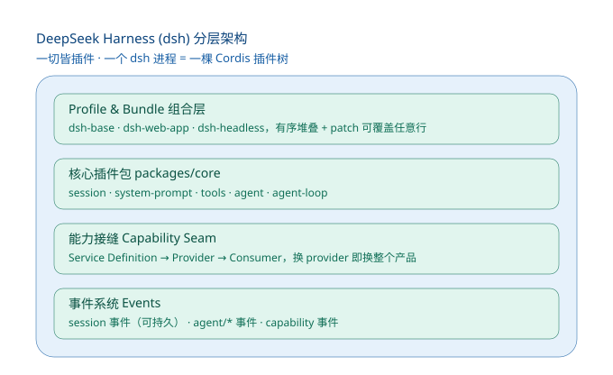

---

## 二、核心架构理念

### 2.1 ctx（上下文）是整个架构的中枢

**所有插件只跟 ctx 交互，插件之间零耦合。** ctx 是三样东西的合体：

| 角色 | 机制 | 代码 |
|---|---|---|
| 注册中心 | 插件往里存能力 | `ctx.provide` / `ctx.set` |
| 依赖解析器 | 插件从里取能力 | `ctx.get` / `inject` |
| 生命周期编排器 | 卸载时逆序回滚 | `fiber.dispose()` |

- 插件**注册贡献**（`ctx.on/set/provide`），每次注册都返回一个 `disposer`。
- 插件**消费依赖**（`ctx.get`），依赖没就绪就挂起（`PENDING`）。
- 卸载一个插件 = 逆序执行它所有的 `disposer`，ctx 精确回到加载前。

> ctx 的**具体实现**（effect、store、mixin、notify）见[四、核心机制](#四核心机制effect与注册)。

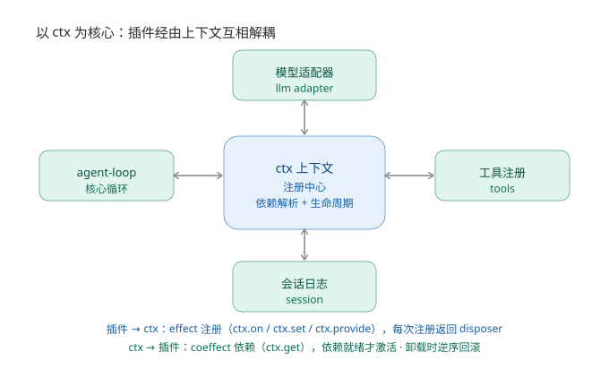

### 2.2 两个正交维度（来自论文）

| 维度 | 解决的问题 | 对应机制 |
|---|---|---|
| **时序可组合性**（时间） | 卸载时完全撤销副作用 | 可逆效应（revertible effects） |
| **空间可组合性**（空间） | 声明、发现、解析依赖 | 响应式共效应（reactive coeffects） |

> 两维度的理论细节见[三、理论基础](#三理论基础cordis论文)。

### 2.3 关键分野：loop 中心 vs ctx 中心

| | 以 loop 为核心（Claude Code / Codex） | 以 ctx 为核心（dsh） |
|---|---|---|
| 扩展方式 | 在预留 hook 点打补丁 | 挂新插件，与其它平级 |
| 改循环行为 | hook 点不够就改核心 / 等官方 | 整体替换 agent-loop 插件 |
| 运行时装卸 | 需重启 / 进程级粒度 | 热插拔，逆序回滚 |
| 自修改能力 | 受限（核心不可动） | **天然支持**（连 loop 都可换） |

**dsh 没有"特权核心"**——模型适配器、工具注册表、会话日志、甚至 agent-loop 本身，全都是插件。

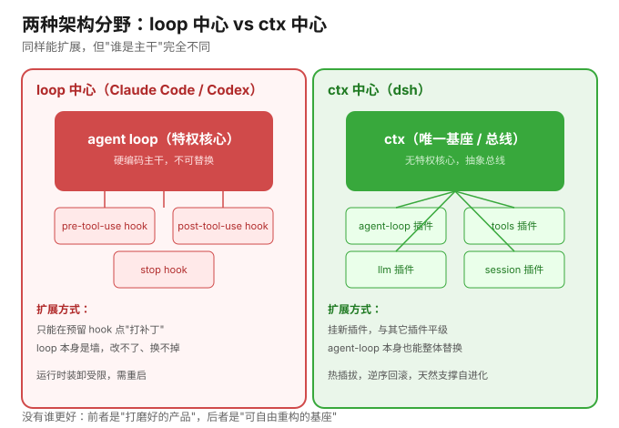

### 2.4 灵活性 vs 成本的权衡

> **dsh 用「更高的 token/资源开销 + 更大的不确定性」，换「更强的可定制性 + 热插拔 + 支撑自进化 agent」。**

| 开销来源 | 原因 |
|---|---|
| token 更多 | 系统提示词由各插件动态拼 section；模型可见内容都要进 session log |
| 资源更多 | 工具调用要过 waterfall 事件链、schema 动态组装 |
| 不确定性 | 动态组合 + 热插拔 → 同样的输入，插件组合不同行为就不同 |

Claude Code / Codex 是"打磨好的产品"，dsh 是"可自由重构的基座"。

---

## 三、理论基础：Cordis 论文

论文：*A Programming Paradigm for Spatiotemporal Composability*（石一凡、张伟、崔天一；北京大学 + DeepSeek-AI，88 页）。

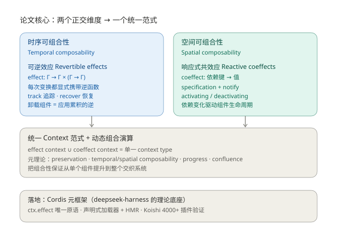

### 3.1 要解决的问题

传统软件组合是**静态**的（编译期定死）。但插件平台、自进化 agent 需要**运行时动态组合**。现状只能靠粗粒度兜底：

- **VSCode**：扩展主机无法热卸载插件（top100 里 87 个含可执行代码，卸载必须重启）；`deactivate` 只是退出回调；`extensionDependencies` 几乎没人用，且 `exports` 无类型。
- **自进化 agent**：每次自修改都重启会丢状态、反复中断在途任务；坏的自修改可能干掉"负责恢复"的进程本身。
- **OS/容器兜底**：进程级时序 + 服务级空间，粒度对不上、有网络开销。

### 3.2 可逆效应（Revertible Effects）—— 时间维度

把副作用建模成"变换 + 它的逆"：

```
effect : Γ → Γ × (Γ → Γ)     // 返回"新上下文" + "显式逆函数"
```

- **效应上下文** `∂Γ = Γ × (Γ → Γ)` = `(γ, φ)`：`γ` 当前状态，`φ` 累加器（所有逆的复合）。
- **track**：`(f,g)` → `∂Γ` 变换，记录逆；**recover**：应用 `φ` 恢复初始状态。
- **扭曲复合（twisted composition）**：`(f1,g1)∘(f2,g2) = (f1∘f2, g2∘g1)` —— 逆按相反顺序累积，**天然 LIFO**。
- 健全性不变式：`φ(γ) = γ0`。

> 落地到代码（`ctx.effect`、`.reverse()`）见[四、核心机制](#四核心机制effect与注册)。

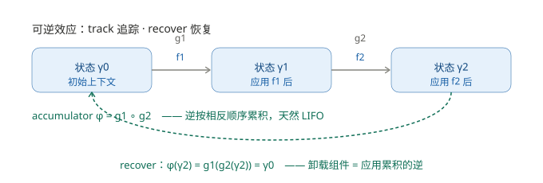

### 3.3 响应式共效应（Reactive Coeffects）—— 空间维度

把 IoC 容器形式化：

```
Σ = (k : K) ⇀ V_k        // 依赖键 → 值 的偏函数
```

两个关键洞见：
1. **`set(k,v)` 本身就是一个可逆效应** —— 共效应操作就是效应，效应可逆。两维度在此焊在一起。
2. 每个键是三元组 `(V_k, ≃_k, A_k)`：值类型 + 等价关系 + 操作集。

响应性来自**满足性判定 + 通知**：

```
notify(σ, σ') = activating    // 依赖从"不满足"变"满足"
              = deactivating  // 依赖从"满足"变"不满足"
              = neutral
```

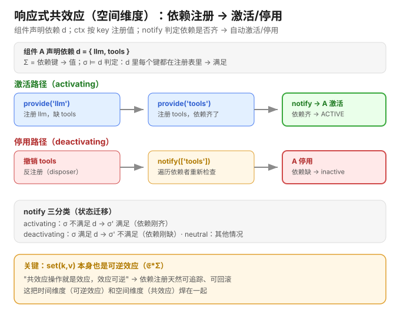

### 3.4 统一范式 + 元理论

效应上下文 ∪ 共效应上下文 = **单一 context type**，构成一个编程范式。然后构造**动态组合演算**（组件 + fiber），覆盖四种转移：

| 转移 | 含义 |
|---|---|
| Withdrawal 撤销 | 撤回依赖，dependents 按序停用 |
| Iteration 迭代 | 单组件内 LIFO 迭代回放 |
| Asynchrony 异步 | 惯性 inertia，异步 teardown 跑完再响应 |
| Failure 失败 | 错误记录到 fiber，目标置 INACTIVE |

**五条元理论性质**：preservation（保持）、temporal composability（时序可组合）、spatial composability（空间可组合）、progress（进展）、confluence（合流）—— 把"单组件可正确装卸"严格推导到"整个交织系统"。

### 3.5 落地：Cordis

| 理论 | Cordis 运行时 |
|---|---|
| `Γ∞` | `ctx`（一等上下文） |
| `effectΓ(e)` | **`ctx.effect(callback)`** —— 唯一变更原语 |
| `get(k)` / `set(k,v)` | `ctx.get(key)` / `ctx.set(key, value)` |
| fiber / accumulator | `fiber` / `fiber.dispose` |
| isolate / intercept | `ctx.isolate(key, realm)` / `ctx.intercept(key, metadata)` |

案例验证：Koishi（4000+ 社区插件的聊天机器人框架）。未来方向：自进化 agent harness（正是 dsh）。

> **可逆性的边界**（哪些能回滚、哪些不能）见[七、安全边界](#七安全边界可逆效应边界)。

---

## 四、核心机制：effect 与注册

> 本章是[3.2 可逆效应](#32-可逆效应)和[3.3 共效应](#33-响应式共效应-reactive-coeffects--空间维度)的**源码落地**。

### 4.1 插件三件套 + 调用链

插件就是一个对象，三个导出：

```ts
export const name = 'my-tool'
export const inject = ['tools']        // 声明依赖

export function apply(ctx: Context) {
  ctx.tools.register(defineTool({...})) // 注册（内部走 ctx.effect）
}
```

加载链：`registry.plugin(plugin, config)` → `new Fiber(ctx, config, Inject.resolve(inject))` → `plugin.apply(ctx)`。

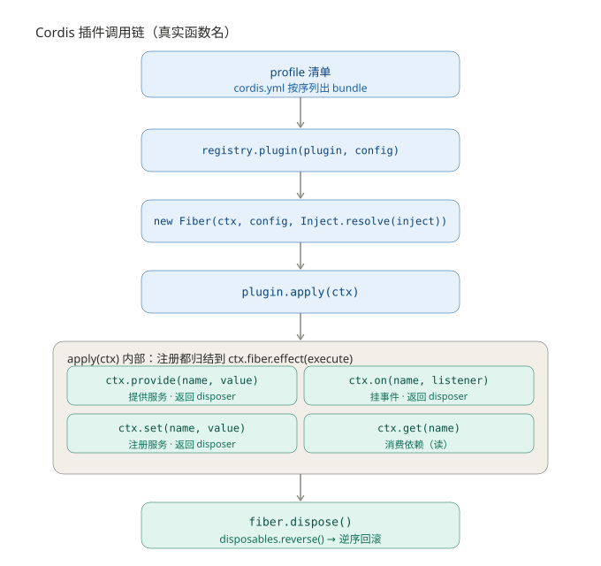

### 4.2 effect 心脏 + 注册链路

**effect 是唯一变更原语**，逆序回滚就是一句 `reverse()`：

```ts
const dispose = () => {
  for (const disposable of disposables.splice(0).reverse()) {
    // 逆序执行（异步串行）
  }
}
```

这一行 `.reverse()` = 论文 twisted composition 的 LIFO 落地。`effect` 有三种返回形态：单 disposer / 生成器（yield 多个）/ 异步。

**Fiber 六态状态机**：`PENDING → LOADING → ACTIVE → UNLOADING → DISPOSED`（+ `FAILED`）。

注册链路（四个入口都归结到 effect）：

```
ctx.provide / ctx.on / ctx.set / ctx.accessor
        ↓（都归结到）
   fiber.effect(execute)          ← 唯一变更原语
        ↓ execute() 做两件事
   store[key] = impl  （注册进注册中心）
   collect(disposer)  （收集逆函数）
        ↓（卸载时）
   dispose() → disposables.reverse()
        ↓
   delete store[key] → notify([name]) → 依赖者 refresh → 激活/停用
```

- **store 不是 HashMap**，是 `Object.create(null)`（无原型对象）+ symbol key + Impl value。
- **ctx.on/get/set 是"转发"来的**：通过 `mixin` 把 events/reflect/registry/fiber 服务的方法挂到 ctx 上。
- **核心 API 速查表**见[八、源码索引](#八源码索引)的附录。

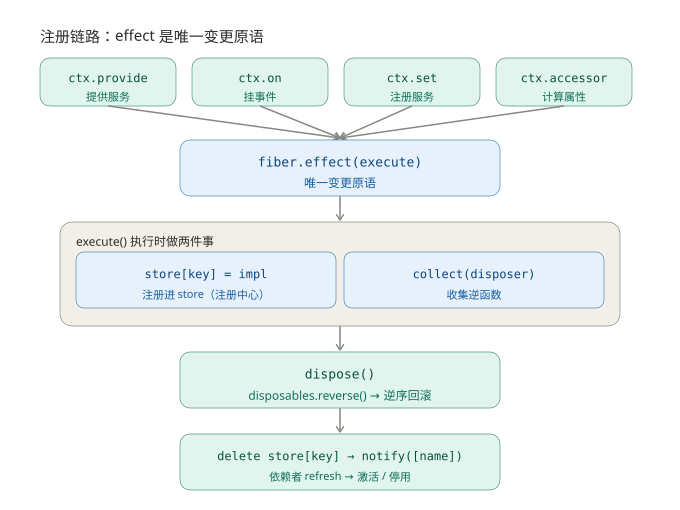

**notify 依赖传播（完整机制）**：依赖注册/撤销时，共效应"响应式"的代码落地，四步：

```
notify(names) 遍历所有 fiber → 找到 inject 声明了这些 name 的（且同 realm）
  → _checkImpl(name)：依赖被撤销/check 不通过 → 从 _store 删掉
  → _refresh()：算 epoch（所有依赖的 fiber.uid 拼接），缺依赖 → INACTIVE
  → _setEpoch()：epoch 变了才动作 → 变"齐"则 _reload（激活）/ 变"缺"则 _unload（停用）
```

- **epoch（活跃指纹）**：fiber 的活跃状态 = 依赖 uid 拼成的字符串，依赖一变指纹就变 → 激活/停用。`uid` 是每个 fiber 的**递增数字**（registry.counter 分配）；用 uid 而非服务名，才能区分"同名但换了实现"（A 换 provider → uid 5→12 → 指纹变 → 重载）。
- **是"状态同步"不是"数据同步"**：notify 只发"通知"（某服务变了），依赖者自己重新拉取值、重算指纹；不把新值推给依赖者。
- **isolation filter**：默认只通知同 realm 的 fiber（接 `ctx.isolate`）。
- **check 函数**：provider 可带校验，不满足就失效；**inertia 惯性**：异步 teardown 跑完再响应（对应论文 asynchrony）。

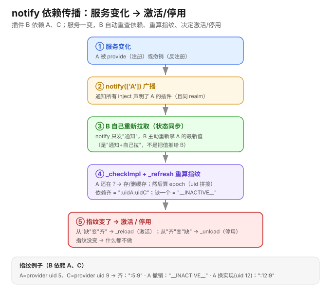

### 4.3 事件系统：五种分发模式

事件总线是插件互相通知的唯一通道。`ctx.on(name, listener)` 挂监听（返回 disposer，可逆），五种触发方式决定"监听器怎么跑、返回值怎么用"：

| 模式 | 一起跑还是排队 | 等不等异步 | 返回值 | 一句话记住 |
|---|---|---|---|---|
| `emit` | 一起（同步） | ❌ 不等 | 忽略 | "喊一嗓子，走人" |
| `parallel` | 一起（并发） | ✅ 等全部 | 收集错误（`AggregateError`） | "群发任务，等交卷" |
| `serial` | 排队 | ✅ `await` | 第一个 bail 值 | "排队问，谁点头停谁" |
| `bail` | 排队 | ❌ 不 `await` | 第一个 bail 值 | "serial 的同步版" |
| `waterfall` | 洋葱层层套 | 看监听器 | 最外层返回 | "中间件，可改可拦" |

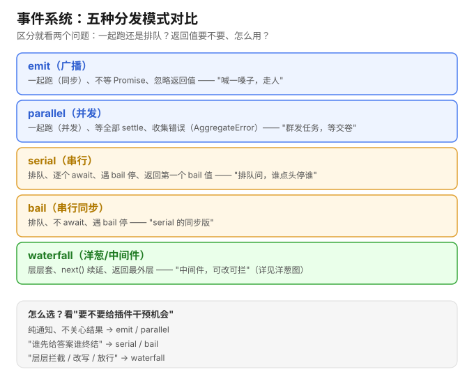

**bail = 返回"非 `null`/`false`/`undefined`"的值**（`isBailed`），一出现就短路。

**waterfall 洋葱模型（最核心 = 中间件模式）**：监听器签名 `(payload, next) => ...`，三个动作——
- `return next()` → **放行**（进入下一层）
- 改 payload 再 `next()` → **改写**
- 不调 `next()` 返回别的值 → **否决**（截断，含内置行为）

实现核心就一个闭包：`const next = () => { const cb = cbs.shift() ?? inner; return cb(...args) }` —— 每次 `next()` 弹出下一个监听器，列表空了就落到 `inner`（内置行为）。

**`on`/`once` 注册 = 可逆效应**：`register` 内部走 `fiber.effect`，返回 disposer，卸载时自动 unregister；`once` = `on` 包一层、首次调用后自 dispose。`prepend:true` 插队（`unshift`）、`false` 排队（`push`）；`filter` 按 ctx 过滤（接 realm 隔离）。

**dsh 真实用例**：`agent/pre-step`、`agent/request`、`agent/request-error`、`tools/pre-execute`/`tools/execute`/`tools/post-execute`、`system-prompt` 组装、`approval/request` 均为 **waterfall**（可拦截/改写）；`agent/turn-stopping` 为 **serial**；`agent/error` 为 **emit**。

**规律**：要不要给插件干预机会，决定用哪种——纯通知用 `emit`/`parallel`；"谁先给答案谁终结"用 `serial`/`bail`；"层层拦截/改写/放行"用 `waterfall`。

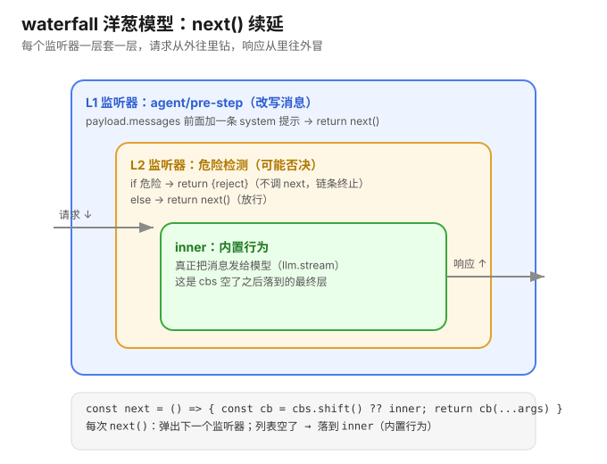

**waterfall 应用全景**（贯穿整个 dsh 的"可拦截"主线，六层次）：

> waterfall 是 dsh「扩展点」的统一实现——从框架内部操作（①），到模型调用（②）、工具执行（③）、提示词组装（④）、安全审批（⑤）、遥测观测（⑥），凡是需要"让插件改写 / 否决 / 放行"的环节，都用 waterfall。这也是 dsh 与"写死 hook 点"架构（见[2.3](#23-关键分野loop-中心-vs-ctx-中心)）最本质的区别：**扩展点不是 if 分支，而是这条可插拔的中间件主线。**

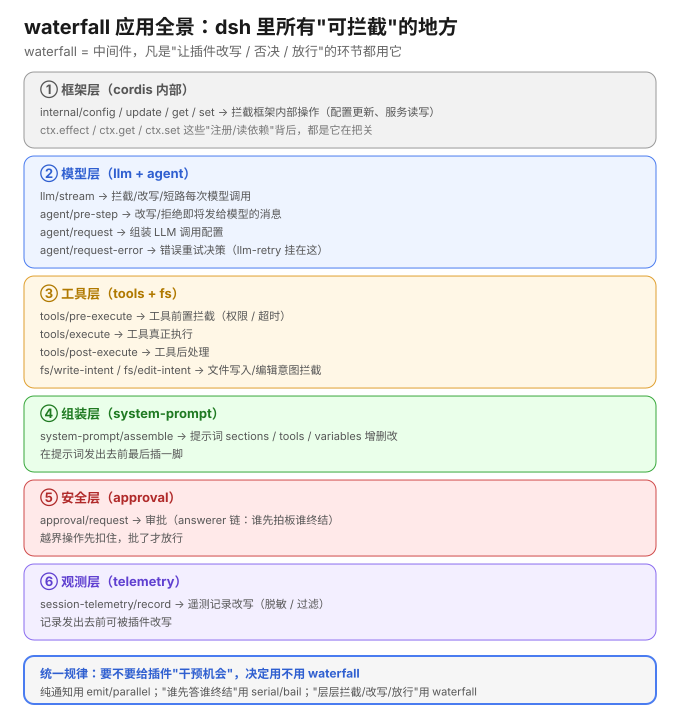

### 4.4 顺序与冲突

**顺序不是运行时拍的，而是启动前写死的分层清单。**

| 东西 | 是什么 | 管什么 |
|---|---|---|
| bundle | 打包「配置行 + 代码」的分发单元 | 一行行插件定义 |
| profile | 一份命名组合 | **按顺序列出**要堆叠的 bundle |
| patch | 补丁文件 | 按 **id** 精确替换某行配置 |

组装顺序（自下而上）：profile 里 bundle（按声明顺序）→ profile patch → home patch → `--patch` 覆盖（优先级最高）。

**两个顺序叠加**：声明顺序管"先装谁"，依赖顺序（coeffect satisfaction）管"谁能开始干活"。

设计动机：**显式 > 隐式**，保证可预测、可复现（`dsh --dump-config` 可打印实际插件树）。

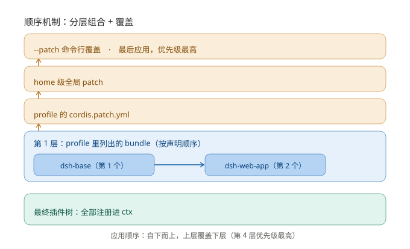

**冲突的两类 + 两种态度**：

| 类型 | 定义 | dsh 怎么处理 |
|---|---|---|
| 结构冲突 | 同 realm 下向同 key 重复 `set` | **响亮失败 + 干净回滚**（前置条件 `k∉dom`） |
| 语义冲突 | 逻辑矛盾但结构不冲突 | 给你两把工具：**patch 覆盖** / **realm 隔离** |

dsh 拒绝"后注册覆盖先注册"——那是"静默咽下冲突"。

### 4.5 扩展的三层

从易到难：

| 层 | 你加的东西 | 需要写插件吗 |
|---|---|---|
| 1. skill | 一个技能声明 | ❌（skill loader 帮你加载） |
| 2. tool | 一个工具（注册到 `ctx.tools`） | ❌ 一般不需要 |
| 3. command | 一条人类命令 | ❌ 不需要 |
| 4. plugin | 一整类新能力（新 llm provider、新沙箱…） | ✅ 需要 |

**关键**：skill / tool 不是"插件的对立面"，它们本身就是由 skill provider / tools registry 这些插件承载的。

---

## 五、agent-loop

### 5.1 主循环

**agent-loop 本身是个插件**：

```ts
export class AgentLoop extends Service implements AgentFactory {
  static inject = ['agents', 'sessions', 'llm', 'tools', 'systemPrompt']
```

三层嵌套循环（Java 直觉）：

```java
void kick() {
    while (turn()) {            // 外层：一轮轮 turn
        while (true) {          // 中层：一个 turn 里循环 step
            preStep();          //    组装提示词 + agent/pre-step 瀑布
            step();             // 内层：一次模型请求 + 工具调用
            if (结束) break;
        }
    }
}

void step() {
    buildRequest(...);                  // 组装请求
    for (chunk : llm.stream(req))       // 调 llm 服务
        session.append("assistant/chunk", chunk);
    session.append("assistant/message");
    if (有工具调用) executeToolCalls(...);  // 调 tools 服务
}
```

扩展点 = 事件瀑布：`agent/pre-step`（waterfall，可改写/拒绝消息）、`agent/turn-stopping`（serial）。

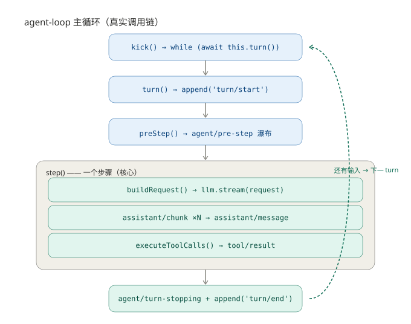

### 5.2 输入侧：inbox 收件箱 + 上下文注入

所有输入先进 inbox，四种方式：

- `followup`（唤醒 · 新一轮）、`steer`（唤醒 · 当前轮下一步）、`inject`（**不唤醒 · 塞上下文**）、`send`（通用）。
- 关键：`inject` 注入的上下文不唤醒 agent，安静躺在 inbox，等下次唤醒消息一起被 claim（"Some messages wake it immediately; injected context waits in the inbox."）。
- 唤醒时若 agent 忙，则 latch 锁存（`wakeRequested=true`），turn 收敛后再启动。

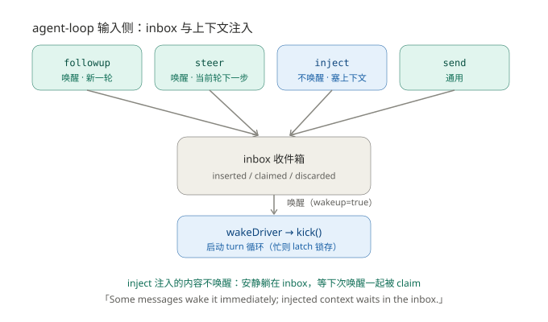

### 5.3 消息重建 + 日志单一事实源

**日志单一事实源（核心概念，全笔记多处引用此处）**：

dsh 把「状态」与「运行时」解耦——**状态不存内存，而是写成日志；运行时需要时从日志读回**。好处：重启不丢状态、可 fork/resume、可回放。

**写**（持久化）：所有事件 `session.append(...)` 落盘（turn/start、user/message、assistant/chunk、assistant/message、tool/result…）。**模型可见 ⟺ 已记录**。

**读**（重建）：日志存"事件"，模型要"消息"，中间投影一层：

- `surface`：只保留产生消息的事件序号（过滤 chunk / 边界 / tool-call / usage）。
- `deriveEventMessage`：三种事件投影成消息（user/message、assistant/message、tool/result），其余 null。
- `deriveMessages`：增量折叠 surface，深冻结 + 缓存 + 支持 replace。
- 核心：日志是单一事实源，模型 / UI / 回放各按需投影。

> 这一概念在[6.2 session fork](#62-session-fork会话分叉日志前缀深拷贝)里被直接复用（fork = 抄日志前缀）。

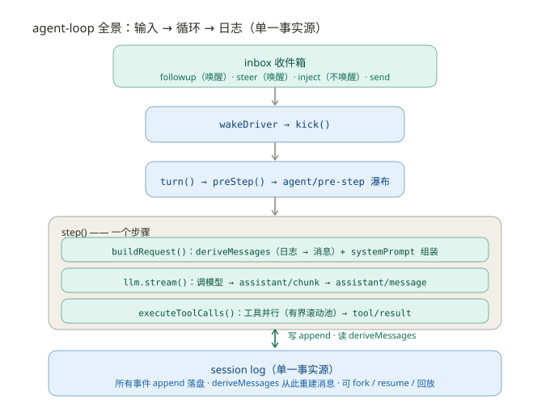

### 5.4 工具并行执行：有界滚动池 + 保序提交

核心机制（`tool-calls.ts`）：

1. **分组**：每个工具声明执行模式（parallel / serial），串行工具会打断并行组成为 barrier。
2. **有界滚动池**：`inFlight.size < maxParallelToolCalls` 控制并发上限，池满不启动新的，有空槽补下一个。
3. **保序提交**：结果按"模型顺序"提交（`commitReady` 只推进连续槽位），而非完成顺序——保证 append-only 的 session log 可回放。
4. **三段式**：`prepare（pre-execute）→ dispatch（execute）→ finalize（post-execute）`。
5. **取消**：停止新启动 → 等已启动 settle → 跳过的调用补 synthetic result。

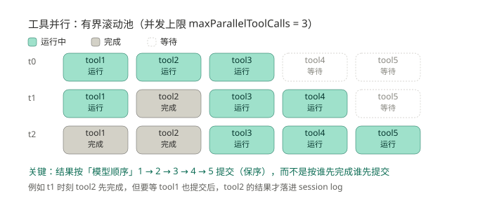

### 5.5 system-prompt 组装：模型看到的静态提示词

**核心**：system prompt 不是写死一段文本，而是**动态拼装**——插件各注册一个带 order 的 section，按序拼、插值变量、过 waterfall。它与[5.3 消息重建](#53-消息重建--日志单一事实源)凑成"模型看到什么"的完整两面（静态提示词 + 动态历史）。

**四种可插拔注册**（都走 `layers.effect` 可逆）：

| 类型 | 方法 | 是什么 |
|---|---|---|
| section | `section({name, order, text})` | 提示词段落（核心） |
| context | `context({name, order, text})` | 动态运行时快照 |
| tools | `tools(provider)` | 工具 schema 提供者 |
| variable | `variable(name, provider)` | `{{变量}}` 插值来源 |

**order 排序约定**（显式声明，不靠加载顺序）：`-100` 框架身份 / `-99` 源码位置 / `0` 人设（`deployment:persona`）/ `100~199` 工具指导，升序拼接。

**assemble 流程**：合并 global+scoped（scoped 同名覆盖 = realm）→ 按 order 排序 → 收集工具 schema（`structuredClone` detach）→ **waterfall**（`system-prompt/assemble`，对 sections/tools/variables 增删改）→ `renderPrompt`（`{{变量}}` 严格插值 + 去空段 + `\n\n` 连接）。

**精妙点**：
- **waterfall = 中间件**：`system-prompt/assemble` 让插件在"结构组装完、文本未渲染"的中间时刻增删改 section/tools/variables；`complete` section 事后恢复，防插件替换核心提示词。
- **变量严格插值**：未知/未定义/未配对 `{{}}` 都当场抛错（显式 > 隐式）。
- **scoped 隔离**：不同 agent 有各自提示词层，persona 可被同名 scoped section 覆盖——这正是 subagent 专属人设（[6.1](#61-subagent-子代理委托)）的底层机制。

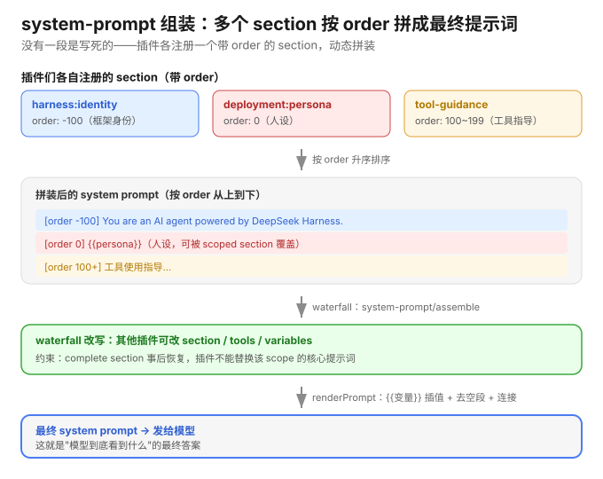

---

## 六、能力接缝实例

> "能力接缝"（Definition / Provider / Consumer 三角色）概念见[2.1](#21-ctx上下文是整个架构的中枢)和[2.2](#22-两个正交维度来自论文)。

### 6.1 subagent 子代理委托

**subagent 是"能力接缝"的典型**：
- Definition：`subagent`（`ctx.subagents`）
- Provider：fork-in-process / spawn-in-process / acp / claude-code / codex / dsh-sdk（换 provider = 换执行方式）
- Consumer：`tool-subagent`（暴露给模型的工具）

**保障机制（6 层）**：

| 保障层 | 机制 |
|---|---|
| 能力校验 | `assertCapabilities`：请求的能力 provider 不支持就拒绝 |
| 深度限制 | `depthLimit`：每委托一层 +1，超 `maxDepth` 抛错 |
| 工具过滤 | `toolFilter`：子 agent 只能用受限工具子集 |
| 权限策略 | `permission`（allow / reject） |
| 取消传播 | `signal` / abort → CANCELLED |
| 进程隔离 | spawn / acp 出进程 |

**depthLimit 的精妙**：深度写两个载体（`options.subagentDepth` 运行时 + `header.delegationDepth` 持久化），读取 `Math.max(header, runtime)` → **只能加深不能降低**，防"恢复的子 agent 重置深度后装成顶层 agent 套娃"。

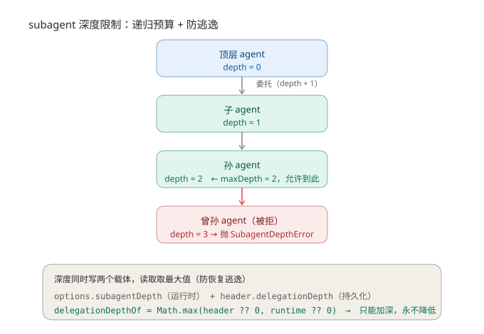

**toolFilter（工具过滤）**：白名单 `allow` + 黑名单 `deny`。实现 `ctx.tools.restrict(filter)`——子 agent 先 `composeFrom` 继承父工具集，再 restrict 收窄，所以子工具集 ⊆ 父工具集。restrict 返回 disposer（可逆），空过滤器 / 未知工具名当场报错。

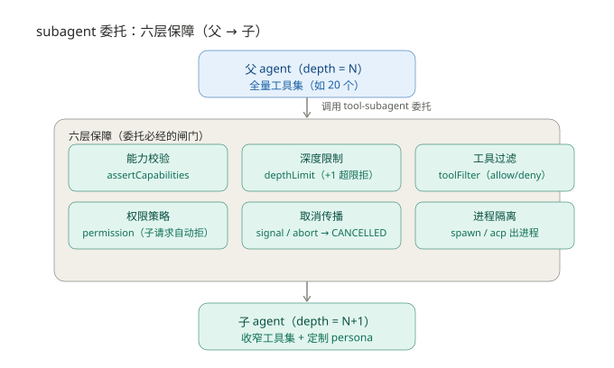

### 6.2 session fork（会话分叉）：日志前缀深拷贝

- dsh 的"分支"是 **session fork**，不是 Git branch。
- 本质：`events.slice(0, boundary+1)` 取源日志前缀，`snapshotJsonValue` 无损深拷贝 detach，装进**独立的新 log**；之后源 / 子各自 append。
- 边界校验：不能分叉在 open turn 中间（`OPEN_TURN`）。
- 复制策略对比：读（`deriveMessages`）共享冻结 vs fork 深拷贝 detach（详见[5.3](#53-消息重建--日志单一事实源)）。
- 印证：日志是单一事实源 → fork 就是"抄日志前缀"，简单、可验证、不遗漏。

### 6.3 compaction（上下文压缩）：历史压成结构化摘要

**又是能力接缝**：Definition `CompactionEngine`（`ctx.compaction`，`compactIfNeeded` 自动 / `compactNow` 手动 / `compactRegion` 强制）；Provider `compaction-basic`；Consumer agent-loop / session。

**核心**：上下文快爆时，把较早一段历史交给 LLM 压成**结构化摘要**，替换原文，腾出空间。**是摘要替换，不是删除**——原文在 log 里可回放，模型只看到"摘要 + 未压缩尾部"。

**四阶段**：

```
① 触发（pressure / context-overflow / 手动命令）
② 选范围 selectCompactableRange
③ 摘要 summarizeWithLlm
④ 替换（shadow）
```

**选范围算法**：从后往前累加 token 凑满 `retainTokens`（保留最近尾巴），切点若切断 tool-call/result 配对就往前挪到平衡点。→ 压最早的、留足最近的。

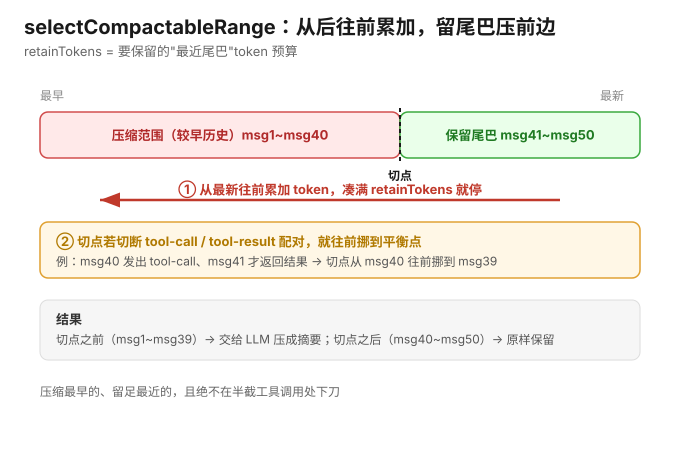

**结构化摘要（固定 8 个 section）**：Primary Request / Key Tech Concepts / Files and Code / Errors and Fixes / Pending Jobs / Current Work / Next Step / Critical Context。硬规则：保留原路径/命令/错误串/签名、不提"被压缩"、旧 checkpoint 合并而非照抄。

**复用 KV cache（最精妙）**：摘要指令作为**最后一条 user message**（而非独立 system prompt），使辅助调用 = 最后那次真实请求的**前缀**，provider 前缀缓存复用，只算新增指令。

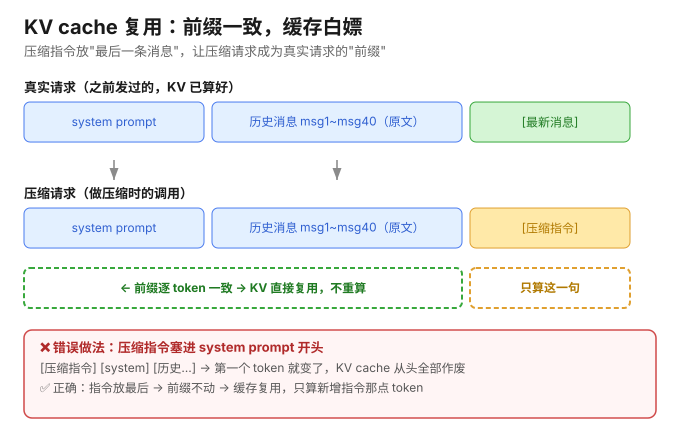

**工具配对平衡**：`inProgressToolCalls` 计数器（`assistant/message` 的 tool-call +N，`tool/result` -1），切点平衡当 counter===0，否则切断 call/result 配对。

**shadow**：`compaction/start`/`summary`/`end` 是 log-only（模型不可见）；真正替换是紧随其后的 user/message（带 `compactCheckpointSource` 标记 `{kind:'plugin',plugin:'compact'}` + `<compacted-summary>` 标签），日志有 `shadowedSeqs` 可回放。

**stability + 防越压越大**：摘要异步期间 surface 变了 → 快照对比（开始拍快照、结束再 measure，不一致就 `SurfaceChangedError` 拒绝）。两个级别：`whole-surface`（手动 idle，要求全局静止）/ `selected-span`（自动 active，只要求替换段不变——新消息落尾巴与替换段不重叠）。另有一道保险：摘要 token ≥ 原文 token 直接拒绝（防越压越大）。

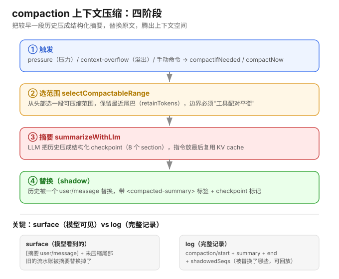

### 6.4 LLM 适配层：换模型厂商不改代码

**能力接缝的模型版**：
- Definition：`LlmRuntime`（`ctx.llm`）+ `LlmAdapter` 抽象类（`stream(options)`）
- Provider：`llm-deepseek` / `llm-pi-ai`（各实现 `stream`，对接不同厂商）
- Consumer：agent-loop（调 `ctx.llm.stream()`）

**核心**：用统一接口 `stream()` + 各厂商"转接头"（adapter），让"用模型的人"和"具体哪个模型"解耦——换厂商 = 换 provider，接口不变。

**`llm/stream` waterfall**：每次调模型都过中间件，插件可改写 options / 短路（mock）/ 包装 chunk 流。retry / replay / routing 都挂在这，不写死核心。

**错误统一成 chunk**：adapter 抛错不直接抛，包装成 `finish` chunk（error/aborted），成功/失败/中止走同一套流协议。

**重试两半**：
- `retry-policy`（provider 拥有）：`normal`（只重试瞬时错误 RATE_LIMIT/SERVER/TIMEOUT/TRANSPORT/EMPTY_RESPONSE，maxRetries=2）/ `always`（一直重试）；指数退避 + jitter（500ms 初始 / 10s 上限 / 0.1）。
- `llm-retry` 插件（`inject: ['agents']`）：监听 `agent/request-error`（waterfall），按 policy 决定重试。**重试是独立插件，不写死在核心**。

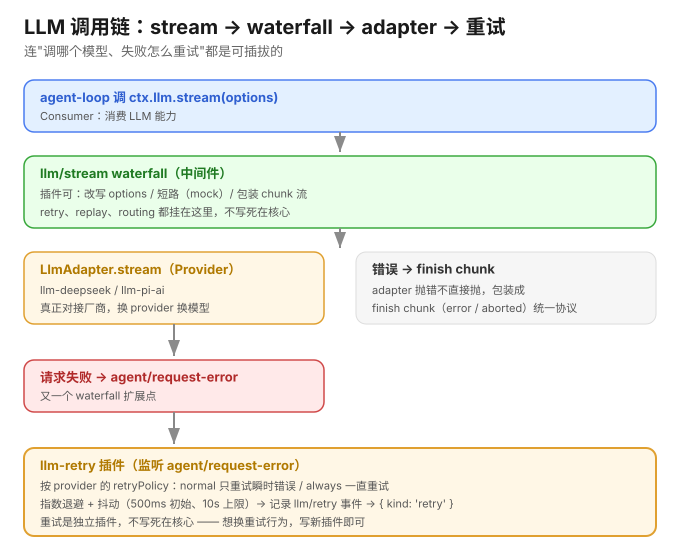

### 6.5 Service Multiplexing（服务多路复用）：能力接缝的终极形态

之前"能力接缝"一直是**独占绑定**（一个接口同一时间只绑定一个实现，切换要卸载+加载、有扰动）。论文 §6.2 讲了更强大的**多路复用（service broker）**：

| 形式 | 含义 | 特点 |
|---|---|---|
| 独占绑定 | 一个接口同一时间只绑定一个实现 | 切换有短暂扰动 |
| 多路复用（broker） | 多个 provider 同时注册，broker 按策略路由 | 无扰动，可扩缩容/滚动更新/跨进程 |

**三个应用**：
1. **负载均衡**：broker 按轮询/权重选 provider；provider 可增删扩缩容，卸载自动移出路由集（可逆注册）。
2. **滚动更新**：新 provider 加载注册 → ACTIVE → 流量逐步转移（调权重）→ 旧的清空 in-flight 后卸载。**把"蓝绿部署"这种基础设施操作，降级成"应用级组合模式"**。
3. **跨进程调用**：每个进程有各自 context + 本地 provider，协调组件链接，RPC 保持接口，**对 consumer 透明**。

> 这是"能力接缝"的终极形态：从"换 provider"到"多 provider + broker 路由"，负载均衡/滚动更新/跨进程都在应用层用组合解决。

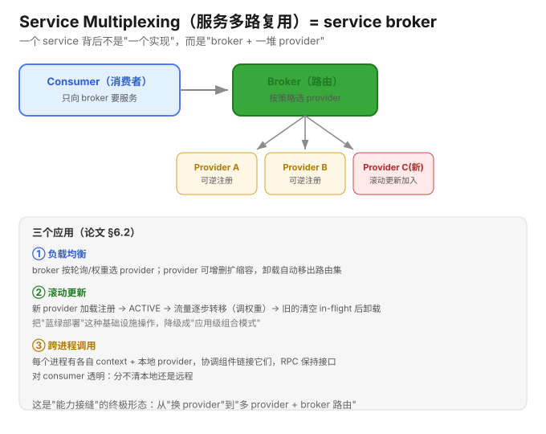

---

## 七、安全边界（可逆效应边界）

> 理论来源：论文 §6.1 System Boundary。


### 7.1 理论

**问题**：`ctx.effect` 能撤销 ctx 内部的操作（注册、挂载），但撤销不了"删文件、发邮件、转账"这种作用在外部世界的操作 → **可逆性有边界**。

**边界二分**：

| | 定义 | 处理 |
|---|---|---|
| 界内 | 系统能独占修改 + 恢复修改前状态 | 追踪进 Γ，可 recover |
| 界外 | 上述能力任一失败 | 操作是 `idΓ`，既不追踪也不恢复 |

**获取 vs 发射**（跨边界的操作分两阶段，落在边界相反两侧）：
- **获取（界内可逆）**：`open`/`close`、`malloc`/`free`、`fork`/`kill`。
- **发射（界外不可逆）**：`write` 写字节、`send` 发数据报 —— 数据出去就回不来。

**不可逆发射的两种兜底**：
- **扣留（withhold）**：推迟发射，直到状态确定会持久化。
- **补偿（compensation）**：事后粗粒度等价恢复（删了重建、转了退款）。

**共效应能移动边界**：reify 一个外部位置，把访问限制在"每个都能提供逆"的操作集里。

### 7.2 落地：沙箱 + 审批

**沙箱三档**（`SandboxMode`）：`read-only`（最窄）→ `workspace-write` → `danger-full-access`（最宽）。

**沙箱核心 = `confine(argv, policy)` 包装命令**：
- `SandboxProvider.confine` 是抽象方法——**包装命令**（不拦截，而是把 argv 包成受限版本），可换 backend（bwrap / Landlock / seatbelt / Windows ACL）。
- `writableRoots(policy)` 现算可写白名单：`read-only` → 空；`workspace-write` → 工作区根 + `/tmp` + 用户临时目录（去重）。
- `danger-full-access` 被 `Exclude` 出 `SandboxPolicy.mode`，即**不走 confine 直接裸跑**。
- fail-closed：无可用 backend 抛 `SANDBOX_UNAVAILABLE`，拒绝裸跑。
- **为何现算而非硬编码**：可写范围本质动态——`workspaceRoot` 随 session 变、`mode` 可升级/降级、`sessionId` 独立隔离。

**审批 = `approval/request` waterfall 事件**：
- answerer = 监听该事件的插件（返回 outcome 拍板 / `next()` 放行 / 无人拍板 fail-closed）。
- 可插拔链：可挂"自动评估 answerer"（低风险秒批）+ "UI answerer"（高风险问人）组合，实现自动审批。
- `escalation`：升级需 `sandbox_permissions` + `justification`（理由）+ 审批。
- `ApprovalPolicy`：`ask`（默认，扣留问用户，fail closed）/ `never`（确定性拒绝）。

| 论文理论 | dsh 落地 |
|---|---|
| 界内可逆 | `ctx.effect` |
| 界外不可逆（发射） | 沙箱挡 + 审批扣留 |
| 扣留 withhold | `approval: 'ask'` |
| 边界移动 reify | `SandboxMode` 三档 + escalation |


### 7.3 工具保障：超时 + 防重复（guard）

两个独立插件，挂在工具流水线上，补全"保障"最后一块：

**timeout-policy（挂 `tools/execute`）—— 协作式超时**：
- 工具声明 `timeoutMs` → `deadline` 造"截止信号" → 临时替换 `exec.signal` → 执行 → 超时替换成 `TOOL_TIMEOUT` 错误。
- 精妙：**协作式**（给信号不杀死，工具自己检测后安全退出，不脏数据 / 不泄漏资源）；scoped timeout（区分自己 / 外层超时）；finally 恢复原信号不污染 post-execute。

**repeat-tool-reminder（挂 `tools/post-execute`）—— 防"复读机循环"**：
- 记录连续重复调用链（key = 工具名 + 规范化参数），命中阈值 `[3,5,8]` 注入提醒（温和 → 详细）。
- 精妙：规范化参数（深 key 排序，`{a,b}` 和 `{b,a}` 算同次）；**观察不否决**（只塞提醒让模型自己改）；用户插话（user 消息）重置链；参数截断 500 字符防大 payload；配置错误 fail-loud。

> 超时防"卡死"（工具永远不返回，会话僵住）；防重复防"想错"（反复做同一件事不推进）。两者都是**可插拔插件，挂在 waterfall 上，不写死在工具核心**。

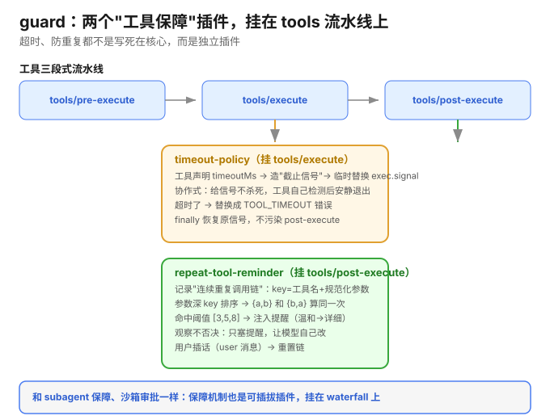

---

## 八、源码索引

| 内容 | 路径 |
|---|---|
| Cordis 上下文 | `vendor/cordis/src/context.ts` |
| 事件服务 | `vendor/cordis/src/events.ts` |
| 反射（get/set/provide/notify） | `vendor/cordis/src/reflect.ts` |
| 注册表（plugin/inject） | `vendor/cordis/src/registry.ts` |
| Fiber + effect 心脏 | `vendor/cordis/src/fiber.ts` |
| agent-loop 主循环 | `packages/core/agent-loop/src/agent.ts`、`index.ts` |
| 工具定义 | `packages/core/tools/`（`defineTool`） |
| 沙箱 | `packages/sandbox/sandbox/src/` |
| 审批 | `packages/interaction/user-approval/src/` |

### 附录：核心 API 速查表

| 函数 | 真实签名 | 作用 |
|---|---|---|
| 插件入口 | `apply(ctx: Context)` | 插件被加载时调用 |
| 提供服务 | `ctx.provide(name, value): () => void` | 注册服务，返回 disposer |
| 挂事件 | `ctx.on(name, listener, options?)` | 监听事件，返回 disposer |
| 注册服务 | `ctx.set(name, value): void` | 注册服务（内部也是 effect） |
| 消费依赖 | `ctx.get(name, strict = true): any` | 读依赖，读不到报错 |
| 隔离 | `ctx.isolate(name, label?)` | 创建隔离子上下文 |
| 拦截 | `ctx.intercept(name, config)` | 拦截服务配置 |
| 可逆效应 | `ctx.effect(execute, label?)` | **唯一变更原语** |
| 加载插件 | `registry.plugin(plugin, config)` | 解析并启动插件 |
| 注入执行 | `registry.inject(deps, callback)` | 依赖注入后执行回调 |
| 卸载 | `fiber.dispose()` | 逆序回滚所有 disposer |
