# 打印驿站 — 后端架构深度解析与面试八股

> 本文档聚焦后端核心设计，覆盖幂等性、防超卖、异步处理、Redis、消息队列、分布式理论等面试高频考点。

---

## 目录

1. [整体架构](#一整体架构)
2. [幂等性设计（高频考点）](#二幂等性设计高频考点)
3. [防超卖/防重复下单](#三防超卖防重复下单)
4. [异步处理与消息队列（RabbitMQ）](#四异步处理与消息队列rabbitmq)
5. [Redis 应用场景详解](#五redis-应用场景详解)
6. [数据库设计精讲](#六数据库设计精讲)
7. [分布式相关面试八股](#七分布式相关面试八股)
8. [面试 Q&A 合集](#八面试--qa-合集)

---

## 一、整体架构

### 1.1 架构图

```
┌──────────────┐     ┌──────────────┐
│  客户 H5      │     │ 服务商管理后台 │
│  (Vue+Vant)  │     │ (Vue+Element)│
└──────┬───────┘     └──────┬───────┘
       │ HTTP/WS            │ HTTP/WS
       ▼                    ▼
┌──────────────────────────────────────┐
│         Nginx（可选反向代理）         │
└──────────────────┬───────────────────┘
                   │
┌──────────────────▼──────────────────────────────────────┐
│                  Spring Boot Backend                    │
│  ┌──────────────────────────────────────────────────┐  │
│  │  Controller 层（接收请求，参数校验，角色鉴权）     │  │
│  ├──────────────────────────────────────────────────┤  │
│  │  Service 层（业务逻辑：状态机/支付编排/工单）     │  │
│  ├──────────────────────────────────────────────────┤  │
│  │  Mapper 层（MyBatis-Plus，数据库访问）           │  │
│  └──────────────────────────────────────────────────┘  │
│                        │                               │
│   ┌───────┬───────┬────┴────┬───────┬───────┐         │
│   ▼       ▼       ▼         ▼       ▼       ▼         │
│ MySQL   Redis  RabbitMQ  WebSocket 文件系统            │
└────────────────────────────────────────────────────────┘
```

**三端架构图（补充图解）**：

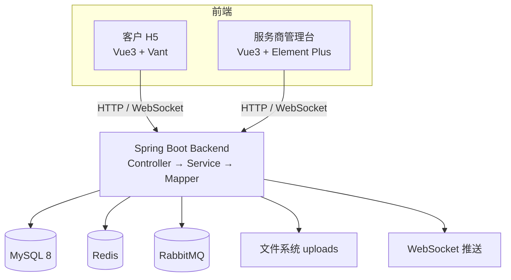

### 1.2 核心依赖关系

```
Controller → Service → Mapper → MySQL
                  ↕
            Redis/RabbitMQ/WebSocket
```

- Controller 层：参数校验（`@Valid`）、角色鉴权（`@PreAuthorize`）、限流（`@RateLimit`）
- Service 层：事务管理（`@Transactional`）、业务状态机
- 所有外部依赖（Redis/MQ/DB）都通过 Service 层封装

**JWT 认证流程（补充图解）**：

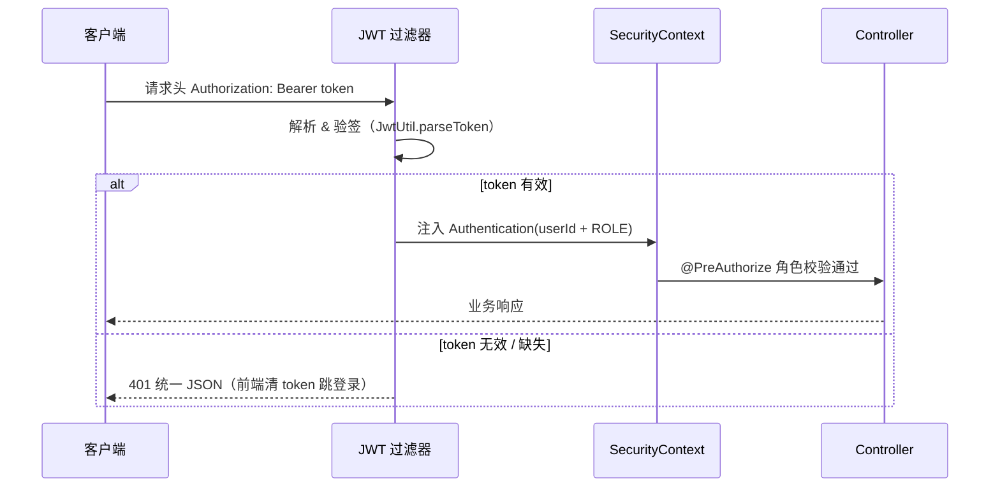

---

## 二、幂等性设计（高频考点）

### 2.1 什么是幂等性？

> **幂等（Idempotent）**：同一个操作无论执行多少次，产生的结果与执行一次相同。

**面试话术**：在分布式系统中，网络抖动、消息重试、用户重复点击都会导致同一个请求被多次执行。幂等性是保证数据一致性的核心手段。

### 2.2 本项目中的幂等实现

#### 场景一：支付回调幂等（三层保障）

**代码位置**：[PaymentService.handleMockConfirm()](file:///f:/java/Print_courier/backend/src/main/java/com/print/courier/service/PaymentService.java#L72-L133)

```
第一层：Redis SETNX 分布式锁（防并发）
第二层：数据库状态判重（防重复回调）
第三层：数据库唯一索引（兜底防重）
```

**逐层详解**：

**第一层 — Redis 分布式锁**：
```java
// 要素3：Redis SETNX 分布式锁，防并发回调竞争
String lockKey = CALLBACK_LOCK + paymentNo;
Boolean locked = redisTemplate.opsForValue().setIfAbsent(lockKey, "1", Duration.ofSeconds(10));
if (Boolean.FALSE.equals(locked)) {
    log.info("回调并发锁拦截 paymentNo={}", paymentNo);
    return; // 直接返回，不抛异常（避免调用方重试导致雪崩）
}
```

- `setIfAbsent` = SETNX（SET if Not eXists）
- 10 秒自动过期，防止死锁
- 锁粒度：按 `paymentNo` 精确锁定，不影响其他支付流水

**第二层 — 数据库状态判重**：
```java
// 要素2：先查状态，已 PAID 直接返回（重复回调幂等）
if (PayStatus.PAID.name().equals(payment.getStatus())) {
    log.info("重复回调幂等返回 paymentNo={}", paymentNo);
    return;
}
```

- 先 SELECT 查询当前状态
- 如果已经是 PAID，直接返回（幂等）
- 这种"先查后改"模式在低并发下有效，但高并发下需要配合锁

**第三层 — 数据库唯一索引**：
```sql
UNIQUE KEY uk_order_payment (order_id, payment_no)
```

- 即使第一层 Redis 锁和第二层状态判断都失效
- 同一 `order_id` + `payment_no` 组合只能插入一条记录
- 第二次插入会抛出 `DuplicateKeyException`，被全局异常捕获

> **面试追问**：为什么不用数据库唯一索引作为唯一保障？
> **回答**：唯一索引只能防插入，不能防更新。支付回调是先查询再更新（UPDATE），如果两条并发请求都查到 UNPAID，会执行两次 UPDATE 造成重复扣款。所以需要 Redis 锁做并发控制。

**支付回调三层幂等时序（补充图解）**：

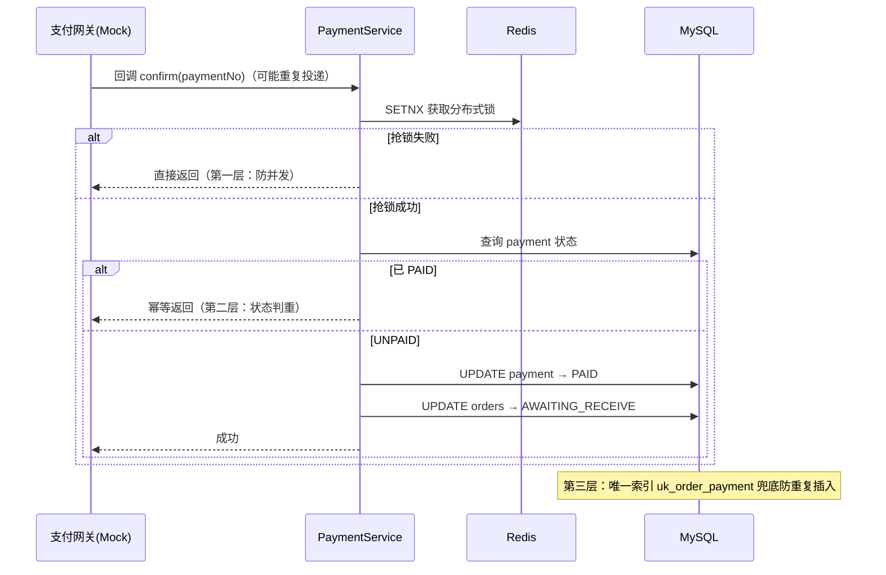

---

#### 场景二：下单防重（5 秒窗口）

**代码位置**：[OrderService.acceptOrder()](file:///f:/java/Print_courier/backend/src/main/java/com/print/courier/service/OrderService.java#L66-L90)

```java
// 防重：同客户 5 秒内不可重复下单
String dupKey = DUP_KEY + customerId;
Boolean first = redisTemplate.opsForValue().setIfAbsent(dupKey, "1", Duration.ofSeconds(5));
if (Boolean.FALSE.equals(first)) {
    throw new BizException(ErrorCode.ORDER_DUPLICATED);
}
```

- 键：`order_dup:{customerId}` — 按客户粒度
- 过期时间：5 秒 — 覆盖前端重复点击的时间窗口
- 原理：SETNX 成功返回 true，失败返回 false

**适用场景**：用户快速双击"提交订单"按钮、前端网络超时自动重试

---

#### 场景三：退款幂等（Redis 锁）

**代码位置**：[PaymentService.refund()](file:///f:/java/Print_courier/backend/src/main/java/com/print/courier/service/PaymentService.java#L136-L189)

```java
// 退款幂等锁
String lockKey = REFUND_LOCK + orderId;
Boolean locked = redisTemplate.opsForValue().setIfAbsent(lockKey, "1", Duration.ofSeconds(10));
if (Boolean.FALSE.equals(locked)) {
    throw new BizException(ErrorCode.DUPLICATE_REQUEST);
}
```

退款后订单状态变为 REFUNDED（终态），后续再次退款会在状态机校验处失败。

---

#### 场景四：工单关闭幂等

**代码位置**：[WorkOrderService.close()](file:///f:/java/Print_courier/backend/src/main/java/com/print/courier/service/WorkOrderService.java#L113-L125)

```java
if (STATUS_CLOSED.equals(wo.getStatus())) {
    return; // 幂等
}
```

- 已经 CLOSED 的工单再次关闭直接返回成功
- 简单但有效，适用于非敏感操作

---

### 2.3 幂等性设计总结

| 场景 | 实现方式 | 粒度 | 特点 |
|------|---------|------|------|
| 支付回调 | Redis 锁 + 状态判重 + 唯一索引 | paymentNo 级别 | 三重保障，最严格 |
| 下单防重 | Redis SETNX 5 秒过期 | customerId 级别 | 轻量，覆盖时间窗口 |
| 退款 | Redis 锁 + 终态校验 | orderId 级别 | 状态机兜底 |
| 工单关闭 | 数据库状态判重 | workOrderId 级别 | 简单幂等 |

---

## 三、防超卖/防重复下单

### 3.1 本项目的"超卖"场景

打印驿站的"超卖"不是传统电商的库存超卖（库存不足却卖出更多），而是：
1. **订单重复创建**：用户快速点击导致同一个请求被提交多次
2. **支付重复扣款**：支付回调被多次调用导致同一笔订单重复扣款
3. **状态并发冲突**：多个操作同时修改同一个订单的状态

### 3.2 防重复下单设计

**完整链路**：

```
用户点击"提交订单"
    ↓
前端 disabled 按钮（防止重复点击）
    ↓
后端 Redis 5 秒防重（SETNX）
    ↓
发 MQ 消息（削峰）
    ↓
消费者异步建单（单线程消费，天然串行化）
    ↓
数据库唯一索引 order_no（UQ）
```

**四层防重链路图（补充图解）**：

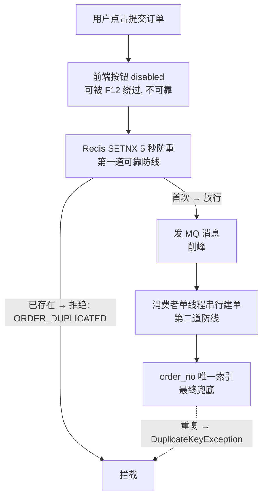

**关键点**：
- 前端防重（按钮 disabled）不是可靠手段（用户可以 F12 绕过）
- 后端 Redis SETNX 是第一道防线
- MQ 单线程消费是第二道防线（串行化处理同一客户的请求）
- 数据库 `order_no` 唯一索引是最终兜底

### 3.3 状态机防超卖

**代码位置**：[OrderStatus.canTransitTo()](file:///f:/java/Print_courier/backend/src/main/java/com/print/courier/common/enums/OrderStatus.java#L28-L36)

```java
public boolean canTransitTo(OrderStatus target) {
    return switch (this) {
        case PENDING_PAYMENT -> target == OrderStatus.AWAITING_RECEIVE || target == OrderStatus.CANCELLED;
        case AWAITING_RECEIVE -> target == OrderStatus.RECEIVED || target == OrderStatus.REFUNDED;
        case RECEIVED -> target == OrderStatus.PRINTED || target == OrderStatus.REFUNDED;
        case PRINTED -> target == OrderStatus.DELIVERED;
        default -> false; // 终态不可流转
    };
}
```

**状态流转图**：
```
PENDING_PAYMENT ──→ AWAITING_RECEIVE ──→ RECEIVED ──→ PRINTED ──→ DELIVERED
       │                                        │
       └──→ CANCELLED                           └──→ REFUNDED
```

- 每个状态明确规定了可达的下一状态
- 终态（CANCELLED/DELIVERED/REFUNDED）不可再流转
- 非法跳转直接抛 `BizException(ORDER_STATUS_INVALID)`

> **面试话术**：状态机是防超卖的终极手段。即使并发请求绕过了所有锁，状态机校验也能保证订单不会从"已配送"退回到"已支付"。

**订单状态机图（补充图解）**：

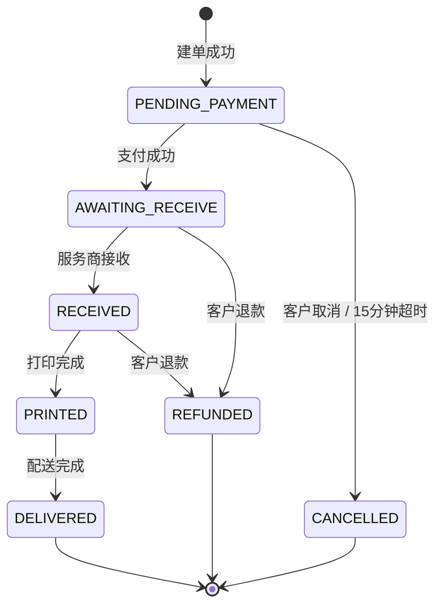

---

## 四、异步处理与消息队列（RabbitMQ）

### 4.1 为什么需要异步处理？

**同步处理的痛点**：
```
下单请求 → 解析 PDF 页数 → 计算价格 → 写数据库 → 写文件系统 → 返回
                                      ↑
                                   耗时约 1-5 秒，用户体验差
```

**异步处理方案**：
```
下单请求 → 快速校验 → 发 MQ → 立即返回 requestId
                                    ↓
                           消费者异步处理（数页/计价/落库）
                                    ↓
                           前端轮询 /poll 获取结果
```

**下单削峰完整时序（补充图解）**：

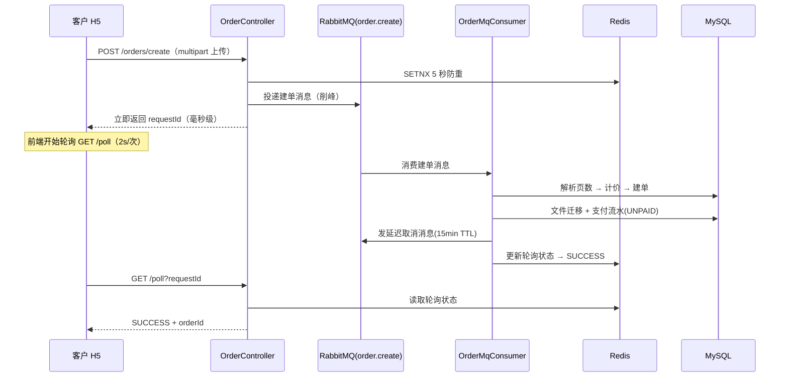

### 4.2 RabbitMQ 队列拓扑

**代码位置**：[RabbitMqConfig.java](file:///f:/java/Print_courier/backend/src/main/java/com/print/courier/config/RabbitMqConfig.java)

```
┌─────────────────────────────────────────────────────────────────┐
│                    RabbitMQ 队列拓扑                             │
│                                                                 │
│  ┌──────────────┐     ┌──────────────────┐     ┌──────────────┐│
│  │ order.create │────→│  order.delay     │────→│ order.cancel ││
│  │   队列       │     │  队列（TTL 15分）│     │  死信队列    ││
│  └──────┬───────┘     └──────────────────┘     └──────┬───────┘│
│         │                                              │        │
│         ▼                                              ▼        │
│  ┌──────────────┐                             ┌──────────────┐ │
│  │ 消费者：建单  │                             │ 消费者：取消  │ │
│  └──────────────┘                             └──────────────┘ │
└─────────────────────────────────────────────────────────────────┘
```

**RabbitMQ 队列拓扑 Mermaid 版（补充图解）**：

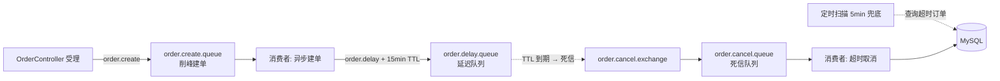

**三个队列详解**：

#### 队列 1：order.create.queue（下单削峰）

| 属性 | 值 |
|------|-----|
| 队列名 | `order.create.queue` |
| 交换机 | `order.create.exchange`（Direct） |
| Routing Key | `order.create` |
| 作用 | 快速受理请求，异步建单 |

**消费者** [OrderMqConsumer.consumeCreate()](file:///f:/java/Print_courier/backend/src/main/java/com/print/courier/mq/OrderMqConsumer.java#L19-L23)：
```java
@RabbitListener(queues = RabbitMqConfig.ORDER_CREATE_QUEUE)
public void consumeCreate(OrderCreateMessage msg) {
    log.info("收到建单消息 requestId={}", msg.getRequestId());
    orderService.createOrderFromMessage(msg);
}
```

**消息体** [OrderCreateMessage](file:///f:/java/Print_courier/backend/src/main/java/com/print/courier/mq/OrderCreateMessage.java)：
```java
public record OrderCreateMessage(
    String requestId,        // 轮询标识
    Long customerId,         // 客户 ID
    Integer colorType,       // 黑白/彩色
    Integer duplex,          // 单面/双面
    Integer copies,          // 份数
    String remark,           // 备注
    String[] tempFiles,      // 临时文件路径数组
    String[] fileNames       // 原始文件名数组
) {}
```

#### 队列 2：order.delay.queue（延迟取消）

| 属性 | 值 |
|------|-----|
| 队列名 | `order.delay.queue` |
| 交换机 | `order.delay.exchange`（Direct） |
| Routing Key | `order.delay` |
| TTL | 15 分钟（900000ms） |
| 死信交换机 | `order.cancel.exchange` |
| 死信 Routing Key | `order.cancel` |

**配置代码**：
```java
@Bean
public Queue orderDelayQueue() {
    return QueueBuilder.durable(ORDER_DELAY_QUEUE)
            .withArgument("x-dead-letter-exchange", ORDER_CANCEL_EXCHANGE)
            .withArgument("x-dead-letter-routing-key", "order.cancel")
            .build();
}
```

**发送延迟消息**：
```java
rabbitTemplate.convertAndSend(
    RabbitMqConfig.ORDER_DELAY_EXCHANGE, "order.delay", order.getId(),
    m -> {
        MessageProperties p = m.getMessageProperties();
        p.setExpiration("900000"); // 15min
        return m;
    });
```

#### 队列 3：order.cancel.queue（死信消费）

| 属性 | 值 |
|------|-----|
| 队列名 | `order.cancel.queue` |
| 交换机 | `order.cancel.exchange`（Direct） |
| 作用 | 15 分钟后到达，消费时取消未支付订单 |

**消费者** [OrderMqConsumer.consumeCancel()](file:///f:/java/Print_courier/backend/src/main/java/com/print/courier/mq/OrderMqConsumer.java#L26-L30)：
```java
@RabbitListener(queues = RabbitMqConfig.ORDER_CANCEL_QUEUE)
public void consumeCancel(Long orderId) {
    log.info("收到延迟取消消息 orderId={}", orderId);
    orderService.cancelTimeoutOrder(orderId);
}
```

### 4.3 死信队列（DLQ）原理

**面试高频考点**：RabbitMQ 死信队列的三种触发条件

1. **消息 TTL 过期**：消息在队列中存活超过设定的 TTL
2. **队列长度超限**：队列中的消息数量超过最大长度
3. **消息被拒绝**：消费者调用 `basic.reject` 或 `basic.nack` 且 `requeue=false`

本项目使用 **条件 1（TTL 过期）** 实现延迟取消：
```
建单成功 → 发送消息到 order.delay.queue（TTL=15min）
    → 15 分钟后消息过期 → 自动转入 order.cancel.queue
    → 消费者检查订单状态 → 未支付则取消
```

### 4.4 兜底方案：定时扫描

**代码位置**：[OrderService.scanTimeoutOrders()](file:///f:/java/Print_courier/backend/src/main/java/com/print/courier/service/OrderService.java#L260-L275)

```java
public int scanTimeoutOrders() {
    LocalDateTime deadline = LocalDateTime.now().minusMinutes(15);
    List<Order> timeouts = orderMapper.selectList(
            Wrappers.<Order>lambdaQuery()
                    .eq(Order::getOrderStatus, OrderStatus.PENDING_PAYMENT.name())
                    .lt(Order::getCreatedAt, deadline));
    // ... 逐个取消
}
```

> **为什么需要兜底？** RabbitMQ 消息可能丢失（队列满了、broker 宕机、网络分区）。定时扫描作为最终一致性保证，确保不会出现永远卡在"待支付"状态的订单。

**延迟取消完整时序（补充图解）**：

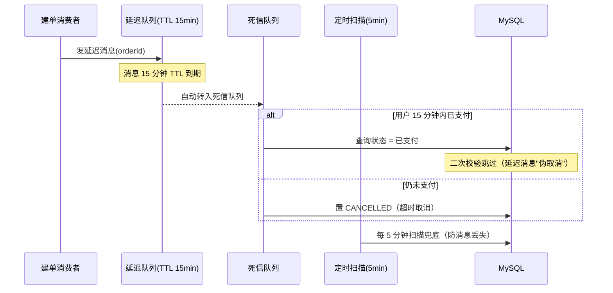

### 4.5 消息可靠性

**消费失败处理**：

```java
// 抛 AmqpRejectAndDontRequeueException：消息不 requeue，避免失败消息无限重试空转
throw new AmqpRejectAndDontRequeueException("建单失败，拒绝消息", e);
```

- `AmqpRejectAndDontRequeueException` → 消息被拒绝，不重新入队
- 如果抛普通异常 → 默认重试 3 次后丢弃
- 为什么不 requeue？防止消息队列被无限重试的消息打满

> **面试追问**：消息丢失怎么办？
> **回答**：本项目对消息丢失的容忍度较高（建单失败后前端轮询会显示 FAILED，用户可以重新下单）。对于需要严格保障的场景，可以启用 Publisher Confirms + 手动 ack。

---

## 五、Redis 应用场景详解

### 5.1 Redis 在本项目中的六大用途

| 用途 | 数据结构 | 键模式 | 过期时间 | 代码位置 |
|------|---------|--------|---------|---------|
| 接口限流 | ZSET（滑动窗口） | `rate_limit:{业务}:{userId/IP}` | 窗口大小 | RateLimitAspect |
| 下单防重 | String（SETNX） | `order_dup:{customerId}` | 5 秒 | OrderService |
| 支付回调锁 | String（SETNX） | `payment_callback:{paymentNo}` | 10 秒 | PaymentService |
| 退款幂等锁 | String（SETNX） | `payment_refund:{orderId}` | 10 秒 | PaymentService |
| 轮询状态 | String | `order:create:poll:{requestId}` | 10 分钟 | OrderService |
| 限流 Lua 脚本 | - | 预加载到 Redis | - | RedisConfig |

### 5.2 接口限流：滑动窗口算法

**Lua 脚本** [rate_limit.lua](file:///f:/java/Print_courier/backend/src/main/resources/scripts/rate_limit.lua)：

```lua
-- KEYS[1]：限流键（rate_limit:{业务}:{用户ID或IP}）
-- ARGV[1]：窗口大小（毫秒）
-- ARGV[2]：窗口内最大请求次数
-- ARGV[3]：当前时间戳（毫秒）

local key = KEYS[1]
local window = tonumber(ARGV[1])
local limit = tonumber(ARGV[2])
local now = tonumber(ARGV[3])

-- 1. 移除滑动窗口之外的旧记录
redis.call('ZREMRANGEBYSCORE', key, 0, now - window)

-- 2. 统计当前窗口内已有的请求次数
local count = redis.call('ZCARD', key)
if count >= limit then
    return 0  -- 超限
end

-- 3. 记录本次请求（member 加随机后缀防同毫秒覆盖）
redis.call('ZADD', key, now, now .. '-' .. math.random(1000000))

-- 4. 设置过期，防止冷 key 常驻内存
redis.call('PEXPIRE', key, window)

return 1  -- 放行
```

**为什么用 Lua 脚本？**
- 原子性：Lua 脚本在 Redis 中原子执行，无需事务
- 减少网络开销：一次网络往返完成所有操作
- 预加载：`RedisConfig` 中 `DefaultRedisScript` 在启动时加载，避免每次请求传输脚本

**为什么用 ZSET 而不是 INCR？**
- ZSET 支持精确的滑动窗口：可以精确移除窗口外的旧记录
- INCR 是固定窗口（如每分钟 10 次），在窗口边界处可能有突发流量

**限流维度**：
```java
enum LimitType {
    USER,  // 按登录用户 ID（适合需登录的接口）
    IP     // 按客户端 IP（适合登录等匿名接口）
}
```

**已应用的限流策略**：

| 接口 | 限流维度 | 限制 | 说明 |
|------|---------|------|------|
| 下单 | USER | 5 次/分钟 | 防止恶意刷单 |
| 创建支付 | USER | 10 次/分钟 | 防止重复创建 |
| 客户登录 | IP | 10 次/分钟 | 防暴力破解 |
| 服务商登录 | IP | 10 次/分钟 | 防暴力破解 |

**故障降级**：
```java
try {
    allowed = redisTemplate.execute(rateLimitScript, ...);
} catch (Exception e) {
    // Redis 故障时降级放行，不影响业务可用性
    log.error("限流脚本执行失败，降级放行 key={}", key, e);
    return pjp.proceed();
}
```

> **面试话术**：限流是保护手段，不是核心链路。Redis 宕机时应该降级放行，而不是让整个系统不可用。

**限流执行流程（补充图解）**：

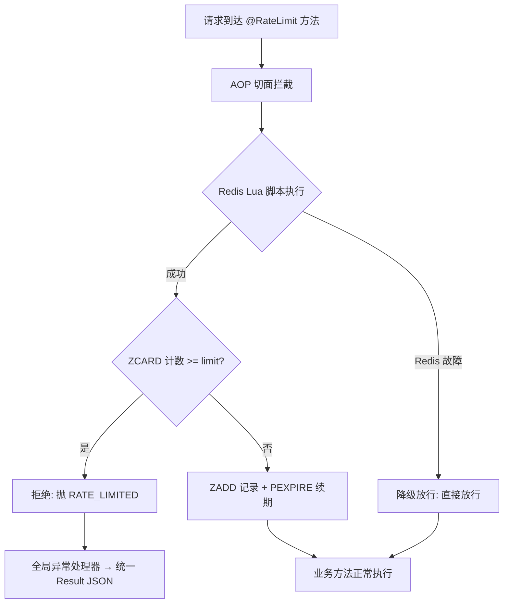

### 5.3 轮询状态：异步建单的"结果通知"

```
下单请求 → 返回 requestId
    ↓
前端循环 GET /poll?requestId=xxx（每 2 秒一次，最多 30 秒）
    ↓
后端从 Redis 读取状态
    ↓
PROCESSING → 继续轮询
SUCCESS   → 跳转订单详情
FAILED    → 提示用户重试
```

**状态存储**：
```java
// 写入轮询初始状态
OrderCreatePollVO init = new OrderCreatePollVO(PollStatus.PROCESSING, null, null, null, null);
redisTemplate.opsForValue().set(POLL_KEY + requestId, toPollJson(init), Duration.ofMinutes(10));
```

**为什么用 Redis 存轮询状态？**
- 性能：Redis 内存操作，QPS 远高于 MySQL
- 临时性：轮询结果只在建单期间需要，10 分钟后自动过期
- 隔离性：不污染数据库，不需要建额外表

### 5.4 Redis 分布式锁模式

本项目中的 Redis 锁都遵循同一模式：

```java
// 1. SETNX 获取锁
Boolean locked = redisTemplate.opsForValue().setIfAbsent(lockKey, "1", Duration.ofSeconds(10));

// 2. 获取失败 → 直接返回（不抛异常，不重试）
if (Boolean.FALSE.equals(locked)) {
    return; // 或 throw BizException(DUPLICATE_REQUEST)
}

// 3. 获取成功 → 执行业务逻辑（加 @Transactional 事务）
```

**为什么不使用 Redisson？** 对于简单的锁场景，SETNX 足够轻量，不需要引入 Redisson 的复杂依赖。

**锁的注意事项**：
- 必须设置过期时间（防止死锁）
- 过期时间要合理（10 秒足够支付回调完成）
- 锁粒度要精确（按 paymentNo 而非全局）

---

## 六、数据库设计精讲

### 6.1 表结构总览

```sql
-- 8 张表，4 个核心业务域

-- 1. 用户域
customer   -- 客户（逻辑删除）
merchant   -- 服务商（逻辑删除）

-- 2. 订单域
orders     -- 订单（逻辑删除，状态机）
order_file -- 订单文件（一单多文件）

-- 3. 支付域
payment    -- 支付流水（幂等核心）

-- 4. 客服域
work_order       -- 工单（未读数设计）
work_order_reply -- 工单回复

-- 5. 配置域
price_config     -- 价格配置
```

### 6.2 核心表详解

#### orders 表

```sql
CREATE TABLE orders (
  id            BIGINT AUTO_INCREMENT PRIMARY KEY,
  order_no      VARCHAR(32)   NOT NULL UNIQUE,  -- 业务订单号
  customer_id   BIGINT        NOT NULL,          -- 客户 ID
  merchant_id   BIGINT        NOT NULL,          -- 服务商 ID
  color_type    TINYINT       NOT NULL DEFAULT 0, -- 0黑白/1彩色
  duplex        TINYINT       NOT NULL DEFAULT 0, -- 0单面/1双面
  copies        INT           NOT NULL DEFAULT 1,
  total_pages   INT           NOT NULL,
  amount        DECIMAL(10,2) NOT NULL,
  order_status  VARCHAR(20)   NOT NULL,           -- 状态机字段
  pay_status    VARCHAR(20)   NOT NULL,           -- 支付状态
  paid_at       DATETIME,                         -- 支付时间
  refunded_at   DATETIME,                         -- 退款时间
  delivered_at  DATETIME,                         -- 配送时间
  cancel_reason VARCHAR(200),
  deleted       TINYINT       NOT NULL DEFAULT 0, -- 逻辑删除
  created_at    DATETIME,
  updated_at    DATETIME,
  KEY idx_order_status (order_status),
  KEY idx_pay_status (pay_status),
  KEY idx_customer_id (customer_id),
  KEY idx_created_at (created_at)
);
```

**设计要点**：

1. **为什么用 VARCHAR 存状态，不用 TINYINT？**
   - 可读性好：`PENDING_PAYMENT` 比 `0` 直观
   - 扩展方便：新增状态不需要改数据库字段定义
   - 缺点：占用空间稍大，但订单表数据量不大，可忽略

2. **为什么 order_status 和 pay_status 分开？**
   - 订单状态和支付状态是两个独立维度
   - 例如：REFUNDED 状态需要同时更新 order_status 和 pay_status
   - 分开便于独立查询和统计

3. **为什么 created_at 要有索引？**
   - 兜底扫描 `scanTimeoutOrders()` 按 `created_at < 15分钟前` 查询
   - 订单列表默认按创建时间倒序排列

#### payment 表

```sql
CREATE TABLE payment (
  id           BIGINT AUTO_INCREMENT PRIMARY KEY,
  payment_no   VARCHAR(32)   NOT NULL UNIQUE,         -- 支付流水号
  order_id     BIGINT        NOT NULL,
  customer_id  BIGINT        NOT NULL,
  amount       DECIMAL(10,2) NOT NULL,
  status       VARCHAR(20)   NOT NULL DEFAULT 'UNPAID', -- UNPAID/PAID/REFUNDING/REFUNDED
  trade_no     VARCHAR(64),                            -- 第三方交易号
  notify_count INT           NOT NULL DEFAULT 0,       -- 回调次数
  paid_at      DATETIME,
  refunded_at  DATETIME,
  UNIQUE KEY uk_order_payment (order_id, payment_no),  -- 幂等索引
  KEY idx_payment_status (status)
);
```

**设计要点**：

1. **唯一索引 `uk_order_payment`**：幂等性的数据库兜底保障
2. **`notify_count`**：记录回调次数，用于监控和排查
3. **`payment_no` 用 UUID 生成**：不可枚举，防伪造支付回调

#### work_order 表

```sql
CREATE TABLE work_order (
  id              BIGINT AUTO_INCREMENT PRIMARY KEY,
  order_id        BIGINT       DEFAULT NULL,     -- 可空：全局咨询
  customer_id     BIGINT       NOT NULL,
  title           VARCHAR(200) NOT NULL,
  status          VARCHAR(20)  NOT NULL DEFAULT 'PENDING', -- PENDING/REPLIED/CLOSED
  unread_customer INT          NOT NULL DEFAULT 0,  -- 客户未读数
  unread_merchant INT          NOT NULL DEFAULT 0,  -- 服务商未读数
  created_at      DATETIME,
  updated_at      DATETIME,
  KEY idx_customer_id (customer_id),
  KEY idx_status (status)
);
```

**设计要点**：

1. **未读数设计**：`unread_customer` 和 `unread_merchant` 独立计数
   - 客户回复 → `unread_merchant + 1`
   - 服务商回复 → `unread_customer + 1`
   - 查看详情 → 清零自己的未读数
2. **原子自增**：使用 `setSql("unread_merchant = unread_merchant + 1")` 而非读-改-写，避免并发丢失更新
3. **`order_id` 可空**：`NULL` 表示全局咨询，不关联具体订单

### 6.3 索引设计原则

```sql
-- 1. 查询条件字段建索引
KEY idx_order_status (order_status)    -- 订单列表按状态筛选
KEY idx_customer_id (customer_id)      -- 客户查询自己的订单
KEY idx_created_at (created_at)        -- 兜底扫描按时间范围查询

-- 2. 唯一约束建唯一索引
UNIQUE KEY uk_order_payment (order_id, payment_no)  -- 幂等兜底
UNIQUE (order_no)                                    -- 订单号唯一
UNIQUE (username)                                    -- 用户名唯一
UNIQUE (config_key)                                  -- 价格配置键唯一
```

### 6.4 逻辑删除 vs 物理删除

```java
@TableLogic
private Integer deleted;  // 0=未删除，1=已删除
```

- 订单表使用逻辑删除（`@TableLogic`）
- 删除时执行 `UPDATE orders SET deleted=1 WHERE id=?`
- 查询时 MyBatis-Plus 自动拼接 `AND deleted=0`
- 保留数据用于审计和对账

---

## 七、分布式相关面试八股

### 7.1 CAP 理论在本项目中的体现

| 概念 | 本项目中的体现 |
|------|--------------|
| **C（一致性）** | 支付回调使用 Redis 锁 + 数据库唯一索引保证最终一致性 |
| **A（可用性）** | Redis 限流故障时降级放行，保证系统可用 |
| **P（分区容错）** | 网络分区时，MQ 消息暂存队列，恢复后继续消费 |

**取舍**：本项目属于 AP 系统，追求高可用性，通过异步和补偿机制保证最终一致性。

### 7.2 BASE 理论

| 概念 | 说明 | 本项目实现 |
|------|------|-----------|
| **BA（基本可用）** | 系统允许部分功能降级 | Redis 故障时限流降级放行 |
| **S（软状态）** | 允许中间状态 | 下单后状态为 PROCESSING，建单完成后变为 SUCCESS |
| **E（最终一致）** | 经过一段时间后最终一致 | 支付回调 + 兜底扫描保证订单状态最终正确 |

### 7.3 分布式锁

**本项目使用的分布式锁方案**：

```
SETNX key value EX seconds
```

**特点**：
- 轻量级，不依赖第三方库
- 适用于低并发、非关键路径的锁场景
- 不处理锁续期（10 秒过期足够）

**面试追问：如果需要更可靠的分布式锁怎么办？**

| 方案 | 优点 | 缺点 |
|------|------|------|
| Redis SETNX | 简单，性能好 | 无法自动续期，主从切换可能丢锁 |
| Redisson | 看门狗自动续期 | 依赖 Redis 稳定性 |
| ZooKeeper | 强一致性，自动释放 | 性能差，部署复杂 |
| 数据库乐观锁 | 无需额外组件 | 性能差，不适合高并发 |

### 7.4 线程池

#### 本项目中的线程池

本项目虽然没有显式创建 `ThreadPoolExecutor`，但底层框架大量使用线程池：

| 线程池 | 来源 | 用途 | 默认配置 |
|--------|------|------|---------|
| **Tomcat 请求处理线程池** | Spring Boot 内嵌 Tomcat | 处理所有 HTTP 请求 | 最大 200 线程 |
| **RabbitMQ 监听器容器线程池** | `@RabbitListener` | 消费 MQ 消息 | 每个队列默认 1 线程 |
| **Spring 任务调度线程池** | `@Scheduled`（隐式） | 定时任务（兜底扫描） | 默认 1 线程 |
| **WebSocket 消息处理线程池** | STOMP 消息代理 | 处理 WebSocket 消息 | SimpleBroker 默认 |

#### 为什么本项目没有自定义线程池？

因为 **MQ 替代了线程池的异步功能**：

```
场景：下单后需要异步建单

方案一（线程池）：Controller → ThreadPoolExecutor.submit() → 建单
方案二（MQ）：    Controller → 发 MQ 消息 → 消费者建单

本项目选择方案二，优势：
- 消息持久化，服务重启不丢失
- 天然削峰填谷（队列缓冲）
- 消费者可独立扩缩容
- 失败处理更完善（死信/重试）
```

#### 面试高频考点

**Q1：如果让你手动给项目加一个线程池，你会加在哪里？为什么？**

A：我会加在**文件上传的 PDF 页数解析**环节。当前是同步解析，可以改为异步：

```java
// 当前：同步解析（阻塞 HTTP 请求线程）
int pages = PdfUtil.parsePages(tmpFile);

// 优化：异步解析（释放 HTTP 请求线程）
CompletableFuture<Integer> future = CompletableFuture.supplyAsync(
    () -> PdfUtil.parsePages(tmpFile), pdfParseExecutor);
```

不过更优的方案是**当前 MQ 异步方案**，因为：
- 线程池的异步任务在应用重启后会丢失
- 线程池没有背压机制，请求突增可能导致 OOM
- MQ 方案更健壮

---

**Q2：Tomcat 线程池满了会怎样？有哪些解决方案？**

A：Tomcat 默认最大 200 线程，满后：
- 请求进入等待队列（默认 100）
- 队列也满后，新请求收到 `Connection refused` 或 503
- 客户端表现为请求超时

**解决方案**：

| 方案 | 说明 | 本项目中的应用 |
|------|------|---------------|
| **异步削峰** | 快速返回，异步处理 | MQ 削峰（核心方案） |
| **限流** | 控制入口流量 | `@RateLimit` 注解 |
| **扩容** | 增加服务实例 | 水平扩展 |
| **调优** | 调整线程池参数 | Tomcat 配置调优 |

---

**Q3：`@RabbitListener` 的线程模型是怎样的？**

A：每个 `@RabbitListener` 队列默认使用 `SimpleMessageListenerContainer`，默认启动 1 个消费者线程。

```java
// 可以通过注解调整并发消费者数
@RabbitListener(queues = "order.create.queue", concurrency = "3-5")
```

- `concurrency = "3-5"`：核心 3 个消费者，最大 5 个
- 多个消费者可以并行消费队列中的消息，提高吞吐量
- 本项目下单队列不需要高并发（削峰后流量可控），使用默认 1 个消费者

---

**Q4：线程池的核心参数有哪些？如何设置合理值？**

核心参数：
```java
ThreadPoolExecutor executor = new ThreadPoolExecutor(
    corePoolSize,      // 核心线程数
    maximumPoolSize,   // 最大线程数
    keepAliveTime,     // 空闲线程存活时间
    TimeUnit.SECONDS,  // 时间单位
    workQueue,         // 阻塞队列
    threadFactory,     // 线程工厂
    handler            // 拒绝策略
);
```

**如何设置合理值？**

```
CPU 密集型：corePoolSize = CPU 核数 + 1
IO 密集型： corePoolSize = CPU 核数 × 2
```

**拒绝策略**：
| 策略 | 行为 |
|------|------|
| `AbortPolicy`（默认） | 抛 RejectedExecutionException |
| `CallerRunsPolicy` | 调用者线程直接执行任务 |
| `DiscardPolicy` | 直接丢弃任务 |
| `DiscardOldestPolicy` | 丢弃队列中最旧的任务 |

---

**Q5：线程池的线程数设置过大或过小会有什么问题？**

| 问题 | 后果 |
|------|------|
| **线程数过小** | CPU 利用率低，吞吐量低，请求排队时间长 |
| **线程数过大** | 线程上下文切换开销大，内存占用高，严重时 OOM |
| **队列过大** | 任务积压，响应延迟高，内存占用高 |
| **队列过小** | 任务频繁被拒绝，吞吐量下降 |

---

**Q6：项目中如何避免线程池导致的 OOM？**

A：本项目虽然没有自定义线程池，但以下措施间接预防了 OOM：

1. **MQ 削峰**：请求不堆积在内存中，而是持久化到 RabbitMQ
2. **限流**：`@RateLimit` 控制入口流量，防止突发请求打满线程池
3. **文件大小限制**：20MB 上限，防止大文件上传长时间占用 Tomcat 线程
4. **超时取消**：15 分钟超时自动取消，释放资源

---

### 7.5 消息队列可靠性

**消息丢失场景**：

```
生产者 → RabbitMQ → 消费者
```

**各阶段消息丢失的风险**：

| 阶段 | 风险 | 解决方案 |
|------|------|---------|
| 生产者 → RabbitMQ | 网络问题导致消息未到达 | Publisher Confirms |
| RabbitMQ 自身 | 宕机导致消息丢失 | 持久化队列 + 持久化消息 + 镜像队列 |
| RabbitMQ → 消费者 | 消费者异常导致消息未处理 | 手动 ack |

**本项目的处理**：
- 队列持久化（`QueueBuilder.durable()`）
- 消费失败投 `AmqpRejectAndDontRequeueException`（不重新入队）
- 兜底定时扫描（`scanTimeoutOrders()`）作为最终保障

### 7.5 最终一致性方案

**下单流程的最终一致性保证**：

```
1. 用户下单 → Redis 写入 PROCESSING 状态
2. 发 MQ 消息 → 消费者异步建单
3. 消费者建单成功 → Redis 更新为 SUCCESS
4. 消费者建单失败 → Redis 更新为 FAILED（消息被拒绝，不重新入队）
5. 前端轮询 → 读取 SUCCESS/FAILED

异常情况：
- MQ 消息丢失 → 兜底扫描（scanTimeoutOrders）不处理新建订单
- 前端轮询超时 → 用户重新查询订单列表
- 建单成功但 Redis 更新失败 → 用户可在订单列表中看到已创建的订单
```

### 7.6 缓存策略

**本项目的缓存策略**：

| 数据 | 缓存位置 | 过期时间 | 策略 |
|------|---------|---------|------|
| 轮询状态 | Redis | 10 分钟 | 写入即过期，无需主动失效 |
| 限流计数器 | Redis | 窗口大小 | 自动过期 |
| 分布式锁 | Redis | 10 秒 | 自动过期 |
| 价格配置 | 每次查询数据库 | - | 数据量小，无需缓存 |

---

## 八、面试 Q&A 合集

### 8.1 架构设计类

**Q1：为什么选择 MQ 异步削峰而不是同步处理订单？**

A：PDF 解析和文件迁移是耗时操作（约 1-5 秒），同步处理会导致：
- HTTP 连接长时间占用，Tomcat 线程池耗尽
- 用户体验差（页面白等 5 秒）
- 并发量高时系统吞吐量急剧下降

MQ 异步方案将响应时间从 5 秒降到 50ms，同时削峰填谷保护数据库。

**MQ 削峰 vs 线程池对比（补充图解）**：

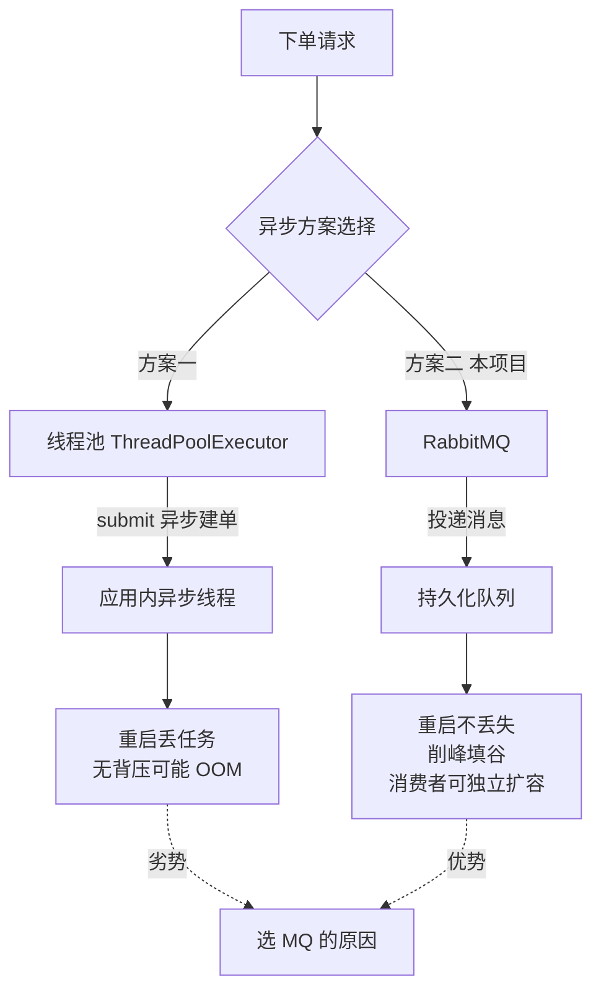

---

**Q2：如果 MQ 挂了，系统还能用吗？**

A：分情况讨论：
- **下单功能**：不可用（因为依赖 MQ 削峰）。但前端会收到错误提示，用户可以稍后重试。
- **其他功能**：查询订单、支付、工单等不依赖 MQ 的功能完全正常。
- **兜底方案**：添加定时任务扫描，即使 MQ 宕机后恢复，也能处理积压的订单。

---

**Q3：为什么选择 RabbitMQ 而不是 Kafka？**

A：场景不同：
- RabbitMQ：适合**任务分发**（下单、延迟取消），特点是消息可靠、路由灵活、延迟队列方便
- Kafka：适合**日志流处理**（埋点、审计），特点是高吞吐、持久化、流式处理
- 本项目订单量级不大，RabbitMQ 完全够用，且其死信队列功能天然支持延迟取消

---

### 8.2 幂等性类

**Q4：支付回调的三层幂等保障，如果 Redis 锁失效了怎么办？**

A：三层保障是递进关系：
1. Redis 锁失效 → 仍有第二层（数据库状态判重）
2. 状态判重失效（两条并发请求都查到 UNPAID）→ 仍有第三层（唯一索引）
3. 唯一索引防的是 INSERT，UPDATE 场景下 Redis 锁是核心保障

极端情况：Redis 宕机 + 数据库唯一索引失效 + 并发请求同时到达，概率极低（约亿万分之一）。如果真的发生，可以通过对账系统发现异常并人工修复。

---

**Q5：订单号 order_no 如何保证唯一？**

```java
private String generateOrderNo() {
    return "PC" + LocalDateTime.now().format(DateTimeFormatter.ofPattern("yyyyMMddHHmmss"))
            + UUID.randomUUID().toString().replace("-", "").substring(0, 8).toUpperCase();
}
```

- 前缀 `PC` + 时间戳（秒级） + 8 位 UUID 十六进制
- 时间戳保证了同一秒内不同订单可区分
- UUID 保证了同一毫秒内不同订单不重复
- 数据库 `UNIQUE` 约束作为最终兜底

---

### 8.3 并发类

**Q6：如何防止用户重复点击下单？**

A：四层防护：
1. **前端**：按钮 disabled（不可靠）
2. **Redis**：5 秒 SETNX 防重（同客户 5 秒内不可重复下单）
3. **MQ**：异步串行化处理（同一队列单线程消费）
4. **数据库**：`order_no` 唯一索引

---

**Q7：如何防止同一条支付回调被多次处理？**

A：三层幂等：
1. Redis SETNX 锁（防止并发）
2. 数据库状态判重（已 PAID 直接返回）
3. 唯一索引 `uk_order_payment`（兜底）

---

### 8.4 Redis 类

**Q8：为什么用 ZSET 做限流而不是 INCR？**

A：ZSET 实现的是**滑动窗口**，INCR 实现的是**固定窗口**。

固定窗口的问题：每分钟限制 10 次，如果用户在 59 秒时发了 10 次，第 60 秒时又发了 10 次，实际 2 秒内发了 20 次。

滑动窗口精确控制任意时间窗口内的请求数，不存在上述问题。

---

**Q9：Redis 限流脚本为什么要用 Lua？**

A：三个原因：
1. **原子性**：Lua 脚本在 Redis 中原子执行，不会被打断
2. **减少网络开销**：一个脚本完成"删除旧记录 + 统计 + 添加 + 设置过期"四个操作，一次网络往返
3. **预加载**：启动时加载到 Redis，后续调用只需传 key 和参数，无需传输脚本内容

---

**Q10：Redis 宕机怎么办？**

A：限流场景降级放行：
```java
try {
    allowed = redisTemplate.execute(rateLimitScript, ...);
} catch (Exception e) {
    log.error("限流脚本执行失败，降级放行", e);
    return pjp.proceed();  // 降级放行
}
```

原则：限流是保护手段，不是核心链路。Redis 故障时不应影响业务可用性。

---

### 8.5 消息队列类

**Q11：延迟取消为什么要用死信队列，而不是直接在代码中 sleep？**

A：sleep 方案的问题：
- sleep 会阻塞线程，浪费系统资源
- 应用重启后 sleep 状态丢失
- 不适合分布式部署

死信队列方案的优点：
- 消息持久化，应用重启不丢失
- 不阻塞任何线程
- 天然支持分布式

---

**Q12：如果延迟消息在 15 分钟内没有到达消费者（MQ 宕机），怎么办？**

A：兜底定时任务 `scanTimeoutOrders()` 每分钟扫描一次，将超过 15 分钟未支付的订单取消。这是最终一致性保证。

---

**Q13：为什么消费失败要抛 `AmqpRejectAndDontRequeueException` 而不是让消息重新入队？**

A：如果消息重新入队：
- 消费者会反复收到同一条失败消息
- 猜测可能的原因：文件格式问题、数据库连接问题等（不是临时故障）
- 反复重试只会浪费资源，且可能堵塞队列

正确做法：记录错误日志，通知运维排查，用户重新下单。

---

### 8.6 数据库类

**Q14：为什么状态字段用 VARCHAR 不用 TINYINT？**

A：取舍问题：
- VARCHAR 优点：可读性好、扩展方便、调试时直接看数据库就知道状态含义
- VARCHAR 缺点：占用空间稍大、查询效率稍低
- 订单表数据量不大（万级），VARCHAR 的性能影响可忽略
- 可读性和可维护性的收益远大于性能损失

---

**Q15：未读数字段为什么用 `setSql` 原子自增，而不是读-改-写？**

A：读-改-写存在并发问题：
```
线程1：读 unread_merchant=0
线程2：读 unread_merchant=0
线程1：写 unread_merchant=1
线程2：写 unread_merchant=1  ← 覆盖了线程1的写入，丢失一次未读
```

`setSql("unread_merchant = unread_merchant + 1")` 是数据库层面的原子操作，不存在并发问题。

---

### 8.7 综合类

**Q16：这个项目有哪些可以优化的地方？**

A：
1. **引入 Redis 缓存**：价格配置等读多写少的数据可以缓存到 Redis
2. **文件上传优化**：使用分片上传，支持断点续传
3. **引入 Elasticsearch**：订单和工单的全文搜索
4. **引入 Redisson**：替换手动 SETNX，获得看门狗自动续期
5. **增加对账系统**：定期比对订单和支付流水，发现不一致自动告警
6. **引入 Sentinel**：替换手动限流，获得更丰富的限流/熔断/降级策略

---

**Q17：你从这个项目中学到了什么？**

A：这是一个完整的分布式系统实践，核心收获：
1. **幂等设计**：三层保障的递进式幂等方案
2. **异步解耦**：MQ 削峰 + 延迟队列 + 死信机制的组合应用
3. **状态机**：严格的状态流转控制，防止数据不一致
4. **最终一致性**：主流程 + 兜底扫描 + 对账系统
5. **Redis 高级用法**：Lua 脚本 + 滑动窗口限流 + 分布式锁

---

## 附录：关键代码文件速查

| 功能 | 文件 | 行数 |
|------|------|------|
| 下单受理 | [OrderService.java](file:///f:/java/Print_courier/backend/src/main/java/com/print/courier/service/OrderService.java) | 344 |
| 支付编排 | [PaymentService.java](file:///f:/java/Print_courier/backend/src/main/java/com/print/courier/service/PaymentService.java) | 190 |
| 工单服务 | [WorkOrderService.java](file:///f:/java/Print_courier/backend/src/main/java/com/print/courier/service/WorkOrderService.java) | 267 |
| 限流切面 | [RateLimitAspect.java](file:///f:/java/Print_courier/backend/src/main/java/com/print/courier/common/aspect/RateLimitAspect.java) | 106 |
| 限流 Lua | [rate_limit.lua](file:///f:/java/Print_courier/backend/src/main/resources/scripts/rate_limit.lua) | 28 |
| MQ 配置 | [RabbitMqConfig.java](file:///f:/java/Print_courier/backend/src/main/java/com/print/courier/config/RabbitMqConfig.java) | 83 |
| MQ 消费者 | [OrderMqConsumer.java](file:///f:/java/Print_courier/backend/src/main/java/com/print/courier/mq/OrderMqConsumer.java) | 31 |
| 状态机 | [OrderStatus.java](file:///f:/java/Print_courier/backend/src/main/java/com/print/courier/common/enums/OrderStatus.java) | 47 |
| 全局异常 | [GlobalExceptionHandler.java](file:///f:/java/Print_courier/backend/src/main/java/com/print/courier/common/GlobalExceptionHandler.java) | 41 |
| Security | [SecurityConfig.java](file:///f:/java/Print_courier/backend/src/main/java/com/print/courier/config/SecurityConfig.java) | 124 |
| 数据库脚本 | [schema.sql](file:///f:/java/Print_courier/sql/schema.sql) | 120 |
| 初始化数据 | [DataInitializer.java](file:///f:/java/Print_courier/backend/src/main/java/com/print/courier/config/DataInitializer.java) | 184 |

---

# 审查补充（2026-08-19，mswyl）

> 以下内容为对本文档的审查补充，不改动原文。重点覆盖 **Redis、消息队列（RabbitMQ）、SQL、分布式** 四个面试高发领域，并勘误原文与代码不一致之处。代码已按《代码审查报告》修复，行号可能存在少量偏移。

## 九、勘误：原文与代码不一致之处

| 原文位置 | 原文表述 | 实际情况（代码为准） |
|---------|---------|---------------------|
| 7.6 缓存策略表 | "价格配置：每次查询数据库，数据量小，无需缓存" | **不准确**。`PriceService` 已实现 Redis 缓存：读时回填（`Duration.ofHours(1)`）、写时**双删缓存**（删→写库→再删），是标准的 Cache-Aside + 双删 |
| 8.2 Q16 优化建议第 1 条 | "引入 Redis 缓存：价格配置等读多写少的数据可以缓存到 Redis" | 价格缓存**已经实现**，面试时如果说"待优化"会被追问打脸；应改为"价格缓存已用双删策略实现，可再优化为延迟双删 + 版本号" |
| 5.2 限流策略表 | 服务商登录 10 次/分钟 | 原文已更新正确（该行是修复后补充的），但注意**修复前服务商登录无限流**——若被问"历史演进"可讲这个修复 |
| 附录行数 | 各文件行数 | 2026-08-19 修复后行数均有偏移，面试引用以代码为准 |

## 十、Redis 深度补充（重点）

### 10.1 价格缓存的 Cache-Aside + 双删（当前代码真实实现）

```java
public BigDecimal getPrice(String cacheKey, String dbKey, BigDecimal defaultVal) {
    String cached = redisTemplate.opsForValue().get(cacheKey);   // 1. 读缓存
    if (cached != null) return new BigDecimal(cached);
    PriceConfig config = ...;                                     // 2. 缓存未命中读库
    redisTemplate.opsForValue().set(cacheKey, val.toPlainString(), Duration.ofHours(1)); // 3. 回填
    return val;
}

public void updatePrice(String configKey, BigDecimal value) {
    redisTemplate.delete(cacheKey);          // 删 1
    priceConfigMapper.updateById(config);    // 写库
    redisTemplate.delete(cacheKey);          // 删 2（双删）
}
```

**为什么双删？** 解决 Cache-Aside 的并发脏读窗口：
```
线程A 读旧值 → 回填旧值到缓存
线程B 更新数据库为 1.2 → 删缓存
（若只删一次：A 在 B 删除后才回填旧值，缓存永久脏）
双删：B 删 2 兜底把 A 回填的旧值再删掉，下次读库拿新值
```

**面试追问：双删仍可能丢（删 2 前又有线程回填）？**
答：可升级为「延迟双删」（删 2 延迟 500ms 异步执行，保证旧值回填窗口已过），或引入版本号/`canal` 监听 binlog 失效缓存。本场景价格更新频率极低，双删已足够。

### 10.2 缓存穿透 / 击穿 / 雪崩（面试必背，结合本项目）

| 问题 | 含义 | 本项目风险与对策 |
|------|------|-----------------|
| **穿透** | 查不存在的 key，每次都打 DB | 轮询状态 key 查不到直接抛 `NOT_FOUND`（前端停止轮询），无空值缓存；可答：布隆过滤器 / 空值缓存短 TTL |
| **击穿** | 热点 key 过期瞬间大量请求打 DB | 价格 key 1 小时过期，更新时双删——删后到下次回填之间若并发高，可答：互斥重建（SETNX 抢锁回填）|
| **雪崩** | 大量 key 同时过期 | 价格 key 仅 2 个，无雪崩面；可答：过期时间加随机抖动、多级缓存 |

> 面试话术：本项目缓存 key 极少且非热点，核心防的是"**穿透**（轮询失效键）"，通过全局异常快速失败避免打爆 DB。

### 10.3 Redis 持久化：RDB vs AOF（项目根目录有 dump.rdb，默认 RDB）

| 对比 | RDB（快照） | AOF（追加日志） |
|------|------------|----------------|
| 原理 | fork 子进程全量快照 | 记录每条写命令 |
| 恢复速度 | 快 | 慢（可 aof-use-rdb-preamble 混合）|
| 数据丢失 | 最多丢最近一次快照后数据 | 按 appendfsync 策略（always/everysec/no）|
| 适用 | 缓存可容忍丢失 | 对数据完整性要求高 |

**本项目取舍**：Redis 只存轮询状态、锁、限流、价格缓存——全部可重建/可容忍丢失，RDB 足够。面试答：**Redis 当缓存用（非唯一数据源）时，持久化策略可以放宽；当存订单号等唯一数据时必须 AOF + 哨兵。**

### 10.4 Redis 过期删除与内存淘汰（补充知识点）

- **惰性删除**：key 被访问时才检查是否过期 → 过期 key 可能残留
- **定期删除**：每秒抽查部分 key → 与惰性互补
- **内存淘汰**（`maxmemory-policy`）：`allkeys-lru` / `volatile-ttl` / `noeviction`（默认）——本项目 key 全部带 TTL，面试可答 `volatile-lru` 更稳

### 10.5 限流键与 X-Forwarded-For 伪造（修复后要点）

修复后 `RateLimitAspect` 默认**不信任** `X-Forwarded-For`（`app.ratelimit.trust-proxy=false`），只有在受信反代后才取该头，否则用 `request.getRemoteAddr()`。

> 面试追问：为什么不能直接信 XFF？
> 答：客户端可随意伪造 `X-Forwarded-For: 1.2.3.4`，直接信会导致**限流维度被绕过**（每次换 IP 头即可无限刷登录）。正确姿势：Nginx 层 `proxy_set_header` 覆盖并只信任最后一跳，或直接取直连地址。

## 十一、RabbitMQ 深度补充（重点）

### 11.1 Per-Message TTL 的「队头阻塞」陷阱（本项目用 per-message TTL）

本项目延迟消息用 `p.setExpiration("900000")`（消息级 TTL），队列**未设** `x-message-ttl`。

RabbitMQ 规则：**只有队列头部的消息才会被检查是否过期**。若队列中先有一条长 TTL（或无限 TTL）的消息，排在后面的短 TTL 消息会被"卡住"，直到头部消息出队才检查。

- 本项目所有延迟消息 TTL 相同（15 分钟），不受影响；
- 若未来支持"用户自定义延时"（如 5 分钟/1 小时混合），必须改用**延时交换机插件（rabbitmq_delayed_message_exchange）**，或**按 TTL 分桶建队列**（每个 TTL 一个队列，经典方案）。

### 11.2 延迟消息无法"取消"——支付成功后的空跑消息

延迟取消消息发出后，如果用户在 15 分钟内支付成功，**该延迟消息不会被撤销**（RabbitMQ 没有按业务 ID 删消息的能力），15 分钟后死信消费者仍会收到它。

```java
// cancelTimeoutOrder 的二次校验：状态已变则跳过，这就是"伪取消"
if (OrderStatus.PENDING_PAYMENT.name().equals(order.getOrderStatus())
        && PayStatus.UNPAID.name().equals(order.getPayStatus())) {
    // 才执行取消
}
```

> **面试话术**：延迟消息的"取消"靠**消费时二次校验业务状态**实现，而不是删除消息。这是 MQ 延时任务的标准做法，也是最终一致性的体现。

### 11.3 消费确认机制（ack）

`@RabbitListener` 默认 **AUTO ack**：
- 方法正常返回 → `basic.ack`（确认，出队）
- 抛出 `AmqpRejectAndDontRequeueException` → `basic.reject(requeue=false)`（拒绝且不入队）
- 抛出其他异常 → 默认 requeue（重试）

| ack 模式 | 说明 | 本项目 |
|---------|------|--------|
| AUTO（默认） | 容器自动根据方法结果 ack | 下单/取消队列均用此 |
| MANUAL | 手动 `channel.basicAck` | 未用；适合"业务完成才确认" |
| NONE | 不确认 | 不适合可靠场景 |

> 面试追问：AUTO ack 会不会丢消息？
> 答：AUTO 下若消费者在业务执行中宕机，消息因未 ack 会回到队列重新投递 → **至少一次（at-least-once）投递**，所以消费端必须幂等（本项目建单靠 order_no 唯一索引 + Redis 防重兜底）。

### 11.4 消息可靠性全景（本项目缺失项 & 面试答法）

| 环节 | 保障 | 本项目状态 |
|------|------|-----------|
| 生产 → Broker | Publisher Confirm（`publisher-confirm-type: correlated`）+ 失败重发 | ❌ 未开启（convertAndSend 无回调）|
| Broker 存储 | 持久化队列 + 持久化消息（Spring AMQP 默认 PERSISTENT）| ✅ 队列 durable；消息默认持久化 |
| Broker 高可用 | 镜像队列 / Quorum Queue | ❌ 单机 |
| Broker → 消费 | 手动 ack + 消费幂等 | ⚠️ AUTO ack + 唯一索引兜底幂等 |
| 兜底 | 定时扫描 | ✅ `OrderTimeoutScanner` 5 分钟兜底 |

> **面试话术**：当前是"丢消息可容忍 + 定时兜底"设计（建单失败前端轮询 FAILED 可重下）。若要上生产，第一优先级是开 Publisher Confirm + 手动 ack；消息重复则靠消费幂等（唯一索引/Redis 防重）。

### 11.5 消息体序列化与跨语言兼容

使用 `Jackson2JsonMessageConverter`，消息带 `__TypeId__` 类型头（全类名）。面试点：
- 优点：可读、跨语言（JSON）
- 坑：`__TypeId__` 绑定 Java 类全名，类名/包名变更或生产消费两端类不一致会反序列化失败 → 生产建议固定 `spring.amqp.deserialization.trust.all` 与白名单，或改用无类型头的纯 JSON + DTO 手动转换

### 11.6 消息积压（面试高频）

| 场景 | 处理 |
|------|------|
| 消费者慢/挂 | 提高 `concurrency`（`@RabbitListener(concurrency="3-5")`）或加消费者实例 |
| 消息堆积 | 先扩消费者消化存量；确认无持续生产后，可**临时停生产者 + 扩容 + 分批重投** |
| 死信堆积 | 监控 DLQ 长度，告警后人工重投（`rabbitmqadmin` / 消费者重放） |

## 十二、SQL 与数据库设计补充（重点）

### 12.1 兜底扫描的索引问题：单列索引 vs 联合索引

兜底扫描 SQL：
```sql
SELECT * FROM orders
WHERE order_status = 'PENDING_PAYMENT' AND created_at < ?;
```
表上有 `idx_order_status` 和 `idx_created_at` **两个独立单列索引**。MySQL 对多条件查询通常只走一个索引（除非 Index Merge），另一个条件回表过滤。

> **优化点（面试加分）**：应建联合索引 `KEY idx_status_created (order_status, created_at)`，覆盖"状态 + 时间范围"查询，且能用到**最左前缀**（单独查 status 也能命中）。同理订单列表 `customer_id + created_at` 也可建联合索引。

### 12.2 逻辑删除 × 唯一索引的冲突（真实存在的设计问题）

`customer.username` 有 `UNIQUE` 约束 + `@TableLogic` 逻辑删除：客户注销（`deleted=1`）后，**该用户名仍被唯一索引占用，无法重新注册**。

```sql
-- 第二次注册同名 → DuplicateKeyException（尽管原记录已逻辑删除）
```

**解决思路（面试题）**：
1. 唯一索引改为 `(username, deleted)` 组合 —— 逻辑删除行 `deleted=1` 不冲突；但重复删除/并发注销仍可能撞（deleted 都是 1）
2. 唯一索引存"注册名+随机后缀"（如 `username#deletedId`）
3. 注销时改 username（加后缀）—— 简单粗暴
4. 物理删除 + 审计表 —— 放弃逻辑删除

> 本项目现状：存在该问题但场景低频（注销后再注册极少），面试如实说明即可，重点展示你**知道这个坑**。

### 12.3 事务隔离级别与"读-改-写"丢失更新（状态机竞态）

`transitStatus` 是「先 SELECT 校验状态机 → 再 UPDATE」的读改写，**没有版本号/乐观锁**（注释写的"updated_at 兜底"并未真正实现 CAS）。两个并发操作可能：
```
线程A（支付回调）：SELECT 到 PENDING_PAYMENT
线程B（超时取消）：SELECT 到 PENDING_PAYMENT
线程A：UPDATE → AWAITING_RECEIVE + PAID
线程B：UPDATE → CANCELLED（覆盖 A！）→ 已支付订单被取消
```

MySQL InnoDB 默认 **RR（可重复读）** 隔离级别，普通 SELECT 是快照读，UPDATE 是当前读，但**无版本字段时后写覆盖先写**，丢更新无法被隔离级别解决。

**修复方案（面试答法）**：
1. **乐观锁**：加 `version` 字段，`UPDATE ... SET status=?, version=version+1 WHERE id=? AND version=?`（影响行数为 0 则重试/拒绝）
2. **条件更新（CAS）**：`UPDATE orders SET order_status='AWAITING_RECEIVE' WHERE id=? AND order_status='PENDING_PAYMENT'`
3. 本项目订单量小、支付与超时并发窗口窄，当前"状态机 + 低概率窗口"可接受，但这是**明确的优化点**。

### 12.4 为什么不建外键（本项目全应用层保证）

| 论点 | 说明 |
|------|------|
| 性能 | 外键约束增加每次 DML 的校验开销 |
| 分布式 | 分库分表后外键失效 |
| 灵活性 | 应用层状态机/逻辑删除更可控 |
| 缺点 | 数据完整性靠代码自觉，漏删会产生孤儿数据 |

> 面试话术：本项目订单/文件/流水的一致性由**事务 + 状态机 + 逻辑删除**在应用层保证，外键用于"必须强一致且低频变更"的场景。

### 12.5 金额与精度

- 金额一律 `DECIMAL(10,2)` + Java `BigDecimal`，**禁止 double/float**（二进制浮点精度问题）
- 计价 `unit × pages × copies` 用 `setScale(2, RoundingMode.HALF_UP)`
- 面试补充：分库分表后的分布式 ID（雪花）、金额快照（下单金额与支付金额比对）——本项目 mock 支付以**流水金额**为准，不信任前端，可展开讲

## 十三、分布式理论补充（重点）

### 13.1 分布式事务：本项目实际用的模式是「本地消息表变体」

面试必问"分布式事务怎么做"，本项目没有 2PC/TCC，但有一个完整的**最终一致链路**，可对标讲：

```
下单：Redis 写 PROCESSING（本地状态）→ 发 MQ（消息）→ 消费者建单 → Redis 改 SUCCESS
           ↑ 相当于"本地消息表"的 role：状态存 Redis（非 DB），消息存 MQ，前端轮询充当"消费确认"
```

| 方案 | 本项目对照 |
|------|-----------|
| **2PC/XA** | 未用（性能差、阻塞） |
| **TCC** | 未用（本场景无预留资源语义） |
| **本地消息表 + MQ** | **本质就是**：业务表 + 消息表同事务，消息表轮询发送；本项目用 Redis 状态替代消息表（弱化版，牺牲"同事务"保证）|
| **MQ 事务消息** | 未用（RocketMQ 特性，RabbitMQ 无） |
| **Saga** | 适用长流程；本项目的"补偿"是退款/取消 |

> **面试话术**：本项目通过「Redis 轮询状态 + MQ + 定时兜底」实现下单的最终一致性，属于本地消息表思想的简化（状态存 Redis 而非 DB，因此 Redis 是唯一数据源风险——Redis 宕机丢状态时靠订单列表兜底可见性）。真正要求强一致的对账场景应引入事务消息或 TCC。

**本地消息表 vs 本项目模式对比（补充图解）**：

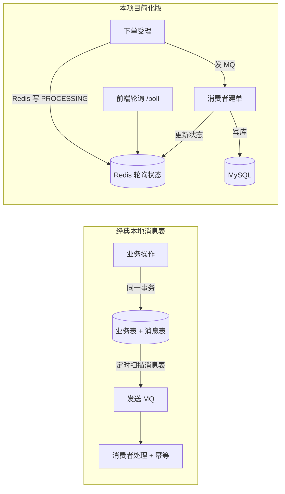

### 13.2 WebSocket 推送的分布式问题（单机 vs 多实例）

`WsPushService.convertAndSendToUser` 依赖 **Spring SimpleBroker（内存）**：
- 单机：`/user/{id}/...` 定向推送正常
- **多实例部署会失效**：用户连在实例 A，推送发到实例 B，B 的内存 broker 没有该用户连接 → 消息丢失

**多实例方案（面试答法）**：
1. **Redis Pub/Sub**：所有实例订阅同一频道，A 收到推送 → 广播频道 → 所有实例尝试推送，目标连接在哪个实例就在哪推
2. **MQ fanout 广播**：同上，RabbitMQ 广播队列
3. **Redis 消息中心（Stream）**：存最近 N 条，客户端断线重连后拉取补偿

> 本项目当前单机部署，无需处理；面试主动提出"多实例时 WS 推送需走 Redis Pub/Sub 广播"是加分项。

**WS 多实例推送方案（补充图解）**：

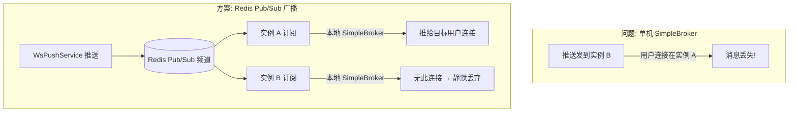

### 13.3 订单号生成：时间戳+UUID 短码 vs 雪花算法

```java
"PC" + yyyyMMddHHmmss + UUID8位hex   // 当前：24 位，纯随机尾部
```

| 对比 | 当前方案 | 雪花算法（Snowflake） |
|------|---------|---------------------|
| 生成 | UUID 截断 | 时间戳 41bit + 机器 10bit + 序列 12bit |
| 有序性 | 无序（尾部随机） | 趋势递增（索引友好、分页稳定）|
| 全局唯一 | 概率唯一（靠 DB 唯一索引兜底）| 理论唯一（时钟回拨有坑）|
| 可读性 | 含时间 | 含时间 |

> 面试答：当前方案**无序**，作为 InnoDB 主键/索引会带来**页分裂**（若 order_no 是聚簇索引）。本项目 `id` 是自增主键、order_no 只是业务号，无此问题；若未来以 order_no 建索引且量大，应换雪花或 `UUID v7`（时间有序）。

### 13.4 分布式 ID 与幂等键设计（补充）

- 幂等键：`requestId`（下单，UUID）、`paymentNo`（支付流水，UUID 24 位短码）——**前端生成 vs 后端生成**：本项目两者都后端生成（acceptOrder 内 UUID、建单时 UUID），前端只透传 requestId，杜绝客户端伪造
- 面试扩展：分布式环境去重表（唯一索引 + 状态机）、幂等键的过期清理

## 十四、新增面试 Q&A（Redis / MQ / SQL / 分布式）

**Q18：价格缓存为什么用"双删"而不是直接删一次？**
A：见 10.1。一次删除存在"删缓存→写库→旧值回填"的竞态窗口，双删把窗口期回填的旧值再删一次；高要求用延迟双删或版本号。

**Q19：RabbitMQ 的延迟消息为什么"取消不了"？如何处理？**
A：MQ 不提供按业务 ID 删除消息的能力。延迟消息到期后**消费时二次校验业务状态**（已支付则跳过），这就是最终一致的补偿式"取消"。要真正删除需记录 messageId 并调用 `basic.nack`/管理 API，不推荐。

**Q20：per-message TTL 和队列 TTL 有什么区别？有什么坑？**
A：per-message 灵活但存在队头阻塞（只检查头部消息）；队列级 `x-message-ttl` 统一但无法差异化。混合使用不同 TTL 时，短 TTL 消息可能被长 TTL 消息堵在队头后面。多档延时建议分桶队列或延时插件。

**Q21：为什么 Redis 限流脚本用 Lua？如果 Redis 是集群怎么办？**
A：Lua 保证原子性 + 一次网络往返。集群下注意：**脚本操作的 key 必须落在同一 slot**（用 hash tag `{key}`），否则 CROSSSLOT 报错。本项目单机 Redis，无此问题；面试可展开讲 Redis Cluster 的 slot 机制。

**Q22：@Transactional 里调用 Redis/MQ 操作会怎样？**
A：Redis/MQ 不是事务资源，不参与 DB 事务回滚。典型坑：**先发 MQ 再抛异常回滚 → 消费者已处理不存在的订单**。本项目建单是"事务内发延迟消息、poll 状态在事务内更新"——若事务回滚，poll 状态更新也回滚，但延迟消息已发出 → 15 分钟后死信消费查不到订单（`selectById` 返回 null 直接 return），正好靠**消费端空判断**兜底。这是很好的面试闭环：**发消息尽量在事务提交后（TransactionSynchronization.afterCommit），或保证消费端幂等/判空**。

**Q23：MySQL 在 RR 隔离级别下，两个并发事务更新同一行会怎样？**
A：行锁（X 锁）串行化更新——后写者阻塞等待先行者提交。但**读改写没有版本校验时，后写会覆盖先写**（丢失更新），隔离级别无法解决，需要乐观锁/条件更新（见 12.3）。

**Q24：逻辑删除后唯一索引冲突怎么处理？**
A：见 12.2。四种方案对比：组合唯一索引（username+deleted）、改名注销、物理删除+审计、唯一索引存后缀。

**Q25：WebSocket 推送多实例会丢吗？怎么解？**
A：会。SimpleBroker 是内存态，连接与推送必须同实例。多实例用 Redis Pub/Sub 广播 + 各实例本地推送，或换 MQ fanout 广播（见 13.2）。

**Q26：本项目是 AP 还是 CP？为什么？**
A：AP。核心链路（下单/支付）通过异步 + 最终一致保证可用性优先；Redis 限流故障降级放行、MQ 削峰缓冲都是 A 的体现；一致性由幂等 + 状态机 + 兜底扫描最终收敛（见 7.1/7.2）。

**Q27：上线前你会优先补哪些可靠性能力？**
A：按优先级：① 支付回调验签 + Publisher Confirm + 手动 ack（钱相关的可靠性）；② 状态流转 CAS/乐观锁（防并发丢更新）；③ 联合索引 `(order_status, created_at)`（扫描性能）；④ 多实例 WS 广播（若扩容）；⑤ 对账定时任务（订单 vs 流水日对账）。每条都能落到本项目代码上，比背概念更有说服力。

---

## 十五、缓存专题深化（更新策略 / 一致性 / 三件套）

> 10.2 已有缓存三件套的精简版，本章为体系化深化，面试可整体背诵。

### 15.1 缓存更新策略四选一（面试必背）

| 策略 | 读 | 写 | 优点 | 缺点 | 本项目 |
|------|----|----|------|------|--------|
| **Cache-Aside（旁路缓存）** | miss 后查库回填 | 删缓存（或更新） | 简单、可控、命中率高的读多写少场景最优 | 一致性问题需自己处理 | ✅ 价格缓存 |
| **Read-Through** | 缓存组件代理读库 | 同左 | 应用只面向缓存，代码简洁 | 需引入缓存框架（Caffeine/Jedis 封装）| ❌ |
| **Write-Through** | 同 Read-Through | 先写缓存再写库（同步）| 读一致性强 | 写放大，性能差 | ❌ |
| **Write-Behind（Write-Back）** | 同 Read-Through | 只写缓存，异步落库 | 写性能极高 | 宕机丢数据风险 | ❌ |

> **面试话术**：本项目选 Cache-Aside，因为价格是"读多写少"（每次下单计价都读、几乎不改），旁路缓存实现最简单且命中率收益最大；写侧用"删缓存"而非"更新缓存"避免并发写覆盖。

**Cache-Aside 读写流程（含双删，补充图解）**：

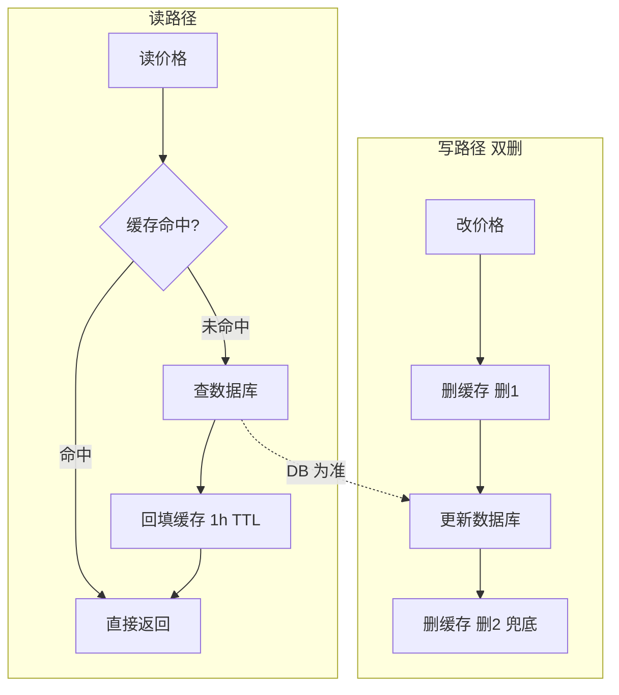

### 15.2 缓存一致性：为什么"删除"而不是"更新"，为什么"双删"

**为什么删而不是更新？**
- 更新缓存存在**并发写覆盖**：线程A/B 同时写库不同值，先写库的 A 后写缓存 → 缓存存了旧值
- 删除缓存更安全：下次读 miss 自然回填最新值，天然自愈

**Cache-Aside 的四种写顺序分析**：

| 顺序 | 并发风险 | 结论 |
|------|---------|------|
| 先更新DB，再删缓存 | 删缓存前有读请求回填旧值 → 短暂脏读（窗口小，可接受）| 常见默认 |
| 先删缓存，再写DB | 删后写库前有读请求回填旧值 → 脏数据长期存在 | ❌ 避免 |
| 先删缓存，写DB，再删（**双删**）| 把窗口期回填的旧值再删一次 | ✅ 本项目 |
| 先写DB，延迟删缓存（延迟双删）| 双删窗口更长场景的加强版 | 可演进 |

> 本项目 `PriceService.updatePrice` 即「删1 → 写库 → 删2」。更严谨的演进：删2 改为 500ms 后异步执行（延迟双删），或引入版本号/Canal 监听 binlog 失效。

### 15.3 缓存三大问题（穿透 / 击穿 / 雪崩）完整版

#### 穿透（查不存在的 key → 全部打 DB）
| 方案 | 原理 | 代价 |
|------|------|------|
| 参数校验 | 非法参数直接拦截 | 无法防合法但不存在 |
| **空值缓存** | 查不到也缓存空值，短 TTL | 内存换一次DB，需防空值雪崩 |
| **布隆过滤器** | key 先过 Bloom，一定不存在直接挡 | 误判率>0、需预热 |

本项目对照：轮询 key 不存在时抛 `NOT_FOUND` 快速失败（前端停止轮询），相当于"参数校验"层；订单查询查不到同理。若未来加"订单号查询"接口，建议订单号布隆过滤器。

#### 击穿（热点 key 过期瞬间打 DB）
| 方案 | 原理 |
|------|------|
| **互斥重建** | 缓存 miss 后 `SETNX` 抢锁，只允许一个线程回填，其余等待/直接查库 |
| **逻辑过期** | 缓存不设 TTL，值里带过期时间，异步线程发现过期后重建 |

本项目价格 key 是全局唯一热点（两个 key 所有请求共享），击穿风险真实存在但更新频率极低（双删窗口毫秒级），可答"互斥重建"作为演进。

#### 雪崩（大量 key 同时过期 → 瞬时打爆 DB）
| 方案 | 原理 |
|------|------|
| **TTL 随机化** | 基础 TTL + random 抖动，避免同秒过期 |
| 多级缓存 | 本地缓存（Caffeine）+ Redis，本地兜底 |
| 熔断降级 | 缓存失效期间直接走 DB + 限流 |

本项目缓存 key 极少（价格 2 个 + 轮询/限流/锁都是短 TTL 自过期），无雪崩面；面试主动讲"我的缓存 key 生命周期短且分散，天然规避"。

### 15.4 本项目 Redis 缓存全景（面试一句话串起来）

| 数据 | 类型 | TTL | 是否唯一数据源 | 丢失影响 |
|------|------|-----|--------------|---------|
| 价格配置 | String | 1h + 双删 | 否（DB 为准）| 无（下次读库回填）|
| 轮询状态 | String | 10min | 是（短时）| 前端轮询失败→查订单列表兜底 |
| 限流计数 | ZSET | 窗口 | 是（瞬时）| 限流失效（降级放行）|
| 分布式锁 | String | 10s | 是（瞬时）| 锁失效→并发兜底靠 DB 唯一索引 |

> 结论：Redis 中**没有不可重建的数据** → 所以持久化可放宽（RDB 足够，见 10.3），Redis 宕机系统最多"短暂不设防"，不会丢业务数据。

---

## 十六、Redis 限流算法全览：固定窗口 / 滑动窗口 / 漏桶 / 令牌桶

> 本项目当前用 ZSET 滑动窗口（见 5.2），本章补全其余算法并解释**为什么这样选**，尤其令牌桶。

### 16.1 四种限流算法对比（面试必背）

| 算法 | 原理 | 允许突发 | 平滑度 | 内存开销 | 实现复杂度 |
|------|------|---------|--------|---------|-----------|
| **固定窗口** | INCR + 过期（1 分钟 10 次）| 窗口边界可双倍突发 | 差 | 极小 | 最简单 |
| **滑动窗口** | ZSET 时间戳精确计数（本项目）| 无突发，精确 | 好 | 随窗口流量增长 | 中（Lua）|
| **漏桶** | FIFO 队列恒速流出 | 完全不允许 | 最平滑 | 需队列 | 中 |
| **令牌桶** | 桶存令牌，rate 补充 | **允许突发**（积攒令牌）| 好 | 常数级 | 中（需 last_refill 状态）|

### 16.2 令牌桶原理与 Redis 实现（面试手写级）

**原理**：一个桶容量 `capacity`（最大积攒令牌数）+ 补充速率 `rate`（每秒补多少令牌）。请求到来必须取走 1 个令牌，桶空则拒绝。**关键特性：允许突发**——空闲期积攒的令牌可支撑瞬时峰值，但长期平均速率被 `rate` 锁死。

**Redis 实现要点（惰性补充）**：不需要定时任务补令牌，而是在取令牌时按"距上次补充的时间差 × rate"补足，一次 Lua 原子完成：

```lua
-- KEYS[1]: 桶 key（HASH: tokens + last_refill）
-- ARGV[1]: 桶容量 capacity
-- ARGV[2]: 每秒补充速率 rate
-- ARGV[3]: 当前时间戳 ms
local bucket = redis.call('HMGET', KEYS[1], 'tokens', 'last_refill')
local tokens = tonumber(bucket[1])
local last = tonumber(bucket[2])
local now = tonumber(ARGV[3])
if tokens == nil then tokens = tonumber(ARGV[1]) end  -- 首次满桶
if last == nil then last = now end
tokens = math.min(tonumber(ARGV[1]), tokens + (now - last) / 1000 * tonumber(ARGV[2]))  -- 惰性补充
if tokens >= 1 then
    tokens = tokens - 1
    redis.call('HMSET', KEYS[1], 'tokens', tokens, 'last_refill', now)
    redis.call('PEXPIRE', KEYS[1], 60000)  -- 冷桶自清理
    return 1  -- 放行
end
return 0  -- 拒绝
```

**令牌桶原理示意（补充图解）**：

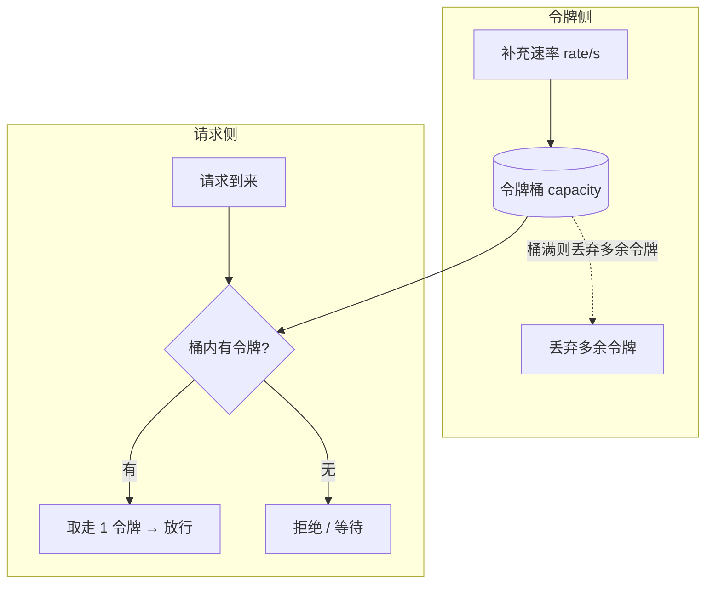

### 16.3 为什么本项目选滑动窗口（ZSET）而不是令牌桶？

**这是面试最容易被追问的设计决策，给一套完整答法：**

1. **限流目标不同**：本项目的限流对象是登录、下单、支付创建——这些是**防刷/防暴力**场景，要求"任意时间窗口内精确计数"。令牌桶的"允许突发"在这里是**缺陷**：攻击者可以先静默积攒令牌，再瞬时打满（例如 capacity=10，静置后连发 10 次）。
2. **语义精确性**：滑动窗口（ZSET）能回答"过去 60 秒内到底来了几次"；令牌桶回答的是"当前桶里还剩多少令牌"，边界语义模糊。
3. **实现成本**：令牌桶需要维护 `tokens + last_refill` 两个状态 + 惰性补充逻辑，Redis 里是 HASH + 更复杂的 Lua；滑动窗口一个 ZSET 脚本搞定，且 ZREMRANGEBYSCORE 自动清旧数据、PEXPIRE 自动清冷 key。
4. **数据规模**：本场景限流 key 量小（按用户/IP），ZSET 内存开销可接受；若限流维度是"每用户每分钟"，高并发下 ZSET 成员数会膨胀，届时才考虑令牌桶或 Redis 4.0 的 `LIMIT` 命令族。

**令牌桶更适合的场景**：API 网关流量整形（允许客户端短时突发但长期配额）、供应商接口配额（如短信 10 条/秒 + 突发 20）、需要"突发 + 平均限速"双约束的地方。

> **面试话术**：算法选型看业务语义——防刷要"精确计数"用滑动窗口，流量整形要"允许突发"用令牌桶，恒定速率用漏桶。本项目四个限流点全是防刷语义，故选滑动窗口；如果未来要接"短信发送限流"这类允许短时突发的场景，令牌桶是更好的选择。

### 16.4 令牌桶 vs 漏桶（补充对比）

| 维度 | 令牌桶 | 漏桶 |
|------|--------|------|
| 突发 | 允许（积攒令牌）| 不允许（恒速流出）|
| 语义 | 有令牌即放行 | 队列有空位才放行 |
| 适用 | 允许瞬时峰值的接口保护 | 严格匀速（削峰填谷、保护下游脆弱服务）|
| Redis 实现 | HASH + 惰性补充 | LIST + LPOP/RPUSH |

---

## 十七、分库分表设计（概念 / 选型 / 演进路径）

### 17.1 分库分表是什么（先讲清楚概念）

| 维度 | 垂直（按业务/列拆）| 水平（按行拆）|
|------|-------------------|-------------|
| **分库** | 按业务域拆库：用户库 / 订单库 / 支付库 | 同结构表拆到多实例：orders_库0~库N |
| **分表** | 拆列：大字段（备注/文件列表）单独表 | 同结构拆多表：orders_0 ~ orders_15 |
| 目的 | 解耦业务、单库连接数/容量压力 | 单表数据量过大（千万级+）|
| 本项目现状 | 单库单表（万级数据，完全够用）| 未分 |

### 17.2 分片键（Sharding Key）的选择——本项目的两难

分库分表第一原则：**让高频查询能定位到单片**，避免全片扫描。

本项目订单有两个高频查询视角：
- 客户视角：`WHERE customer_id = ?`（查我的订单）
- 服务商视角：`WHERE merchant_id = ?`（接单列表）

**两难**：选 `customer_id` 分片 → 服务商查询要跨所有片聚合；选 `merchant_id` 分片 → 客户查询要跨片。

**业界解法（面试答法）**：
1. 主分片键 `customer_id` + **全局索引表**（merchant_id → customer_id 映射，或订单号 → 分片位置），两跳查询
2. **数据冗余/宽表**：服务商侧维护独立副本表（双写 + 异步同步）
3. **搜索引擎**：ES 承载多维度查询，DB 只做单键读写（订单系统常见终态架构）

### 17.3 本项目为什么不分库分表（面试必答，先讲清楚边界）

**数据量维度**：校园打印店订单量级为万~十万级/学期，单表完全支撑；`orders` 表即使 10 年也就百万级，单表 + 索引足够。

**复杂度收益比**：分库分表引入的代价远大于收益——

| 引入问题 | 说明 |
|---------|------|
| 分布式事务 | 订单+文件+流水跨库后无法用本地事务（呼应 13.1）|
| 跨片查询/分页 | 服务商列表要聚合多个分片再排序分页，深分页无解 |
| 分布式 ID | 自增主键失效，需雪花/号段（呼应 13.3）|
| 扩容迁移 | 数据重分布（一致性哈希/虚拟槽）|
| 运维复杂度 | 备份/监控/恢复全部加倍 |

**演进路径（何时才值得分）**：
```
单库单表（现状）
  → 读写分离（主从 + 读多写少，先顶住读压力）
  → 垂直分库（订单/支付/用户按域拆，团队边界清晰后）
  → 水平分表（订单表单表 > 1000 万行时，按 customer_id 分片）
  → 水平分库（单实例连接数/容量到瓶颈）
```

**演进路径图（补充图解）**：


### 17.4 分库分表中间件选型（面试对比）

| 中间件 | 形态 | 优点 | 缺点 |
|--------|------|------|------|
| **ShardingSphere-JDBC** | 客户端 Jar，嵌入应用 | 轻量、无额外节点、性能好 | 每个应用都要配，改造成本在代码 |
| ShardingSphere-Proxy | 独立代理，兼容 MySQL 协议 | 对应用透明 | 多一跳网络，性能损耗 |
| MyCat | 代理 | 成熟、SQL 支持面广 | 较重、更新慢 |
| Vitess | 大规模集群方案 | 云原生 | 复杂 |

> 本项目若演进，首选 **ShardingSphere-JDBC**：与 MyBatis-Plus 生态兼容好，配置分片规则后对业务代码侵入小。

### 17.5 澄清：MyBatis-Plus 分页插件 ≠ 分库分表

项目已用的 `PaginationInnerInterceptor` 是**单库分页**（`LIMIT` 改写）；分库分表中间件（ShardingSphere）做的是**SQL 解析 + 路由改写 + 结果归并**。两者不冲突：分库分表后分页插件仍负责单片内的 `LIMIT`，跨片归并交给 ShardingSphere。

### 17.6 面试一句话总结（可直接背）

> "本项目当前单库单表（万级数据）即最优解，人为分库分表是过度设计。演进路径上，无状态应用 + Redis/MQ 天然支持水平扩容，订单量到千万级先走读写分离，再按 `customer_id` 水平分片并引入 ShardingSphere-JDBC，配套雪花 ID、全局索引表解决双视角查询，跨库一致性用本地消息表/TCC 兜底（呼应 13.1）。"

### 17.7 新增面试 Q&A（缓存 / 令牌桶 / 分库分表）

**Q28：Cache-Aside 为什么删除缓存而不更新缓存？**
A：更新存在并发写覆盖（先写库者后写缓存 → 缓存旧值）；删除后读 miss 自然回填，自愈。删除顺序上避免"先删后写"（窗口期回填旧值），用"先写后删"或双删。

**Q29：令牌桶为什么允许突发？这和限流矛盾吗？**
A：不矛盾。令牌桶是"长期平均速率 + 短时突发容量"双参数模型：空闲积攒的令牌支撑瞬时峰值，长期看平均速率被 rate 锁死。适合 API 配额（允许偶尔尖峰）；防刷场景（登录/下单）恰恰不需要突发，所以本项目用滑动窗口精确计数。

**Q30：什么时候该用令牌桶，什么时候用滑动窗口？**
A：防刷/精确计数（登录、下单、支付）→ 滑动窗口；流量整形/允许突发配额（短信、第三方 API 调用）→ 令牌桶；严格匀速保护下游 → 漏桶。一句话：**看业务允不允许瞬时尖峰**。

**Q31：分库分表后订单列表的分页怎么做？**
A：按分片键查询单片内分页（高频路径）；跨片分页用"先取 ID 再回表"（游标式）或 ES 预聚合；禁止深分页（offset 过大），面试必答这点。

**Q32：分库分表后全局唯一主键怎么生成？**
A：自增失效。方案：雪花算法（趋势递增、ID 含时间可排序）、号段模式（Leaf/美团 Leaf，批量取号段）、UUID（无序，主键索引页分裂）。本项目 `id` 自增 + `order_no` 业务号，若分片则 `order_no` 承担全局唯一（已含时间戳+UUID）。

**Q33：你说"先读写分离再分库分表"，读写分离解决了什么问题？**
A：读压力（主从复制，读走从库）；不解决写压力和单表数据量。主从有复制延迟 → 读自己的写要强制走主库（或用 canal 同步延迟可控）。本项目读多写少但量级小，连读写分离都不必上。

**Q34：本项目 Redis 里有没有不可丢失的数据？**
A：没有。价格以 DB 为准（缓存可重建）、轮询状态可被订单列表兜底、锁与限流是瞬时保护。所以 RDB 持久化即可，Redis 宕机最多短暂不设防，不丢业务数据（呼应 15.4）。

